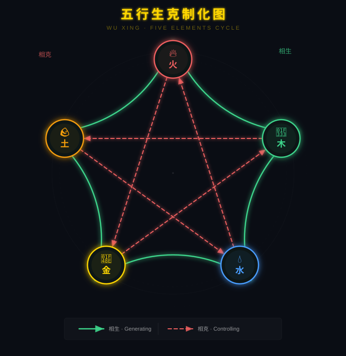

# 第三章 五行生克制化

## 3.1 五行学说的起源与原理

五行学说与阴阳学说共同构成了中国传统哲学的两大支柱。如果说阴阳代表了事物对立统一的"两分法"，那么五行则代表了事物间复杂关系的"五分法"。五行学说起源同样极为古老，最早见于《尚书·洪范》记载的箕子之言："五行：一曰水，二曰火，三曰木，四曰金，五曰土。"

### 3.1.1 五行的基本定义

五行中的"五"指的是五种基本物质或能量形态——木、火、土、金、水；"行"则有运行、流通、变化的含义。因此，五行并非五种静态的物质，而是五种动态的能量模式和运行规律。

**木**：具有生长、升发、条达、舒畅的特性。木曰"曲直"，指树木既可以弯曲也可以伸直，代表生长和发展的潜力。木对应春季，东方，青色。在人体对应肝胆、筋腱、眼睛。木的属性是"仁"，代表温暖的生发之德。

**火**：具有温热、升腾、明亮、活跃的特性。火曰"炎上"，指火焰向上燃烧的趋势，代表热情和向上的能量。火对应夏季，南方，红色。在人体对应心、小肠、血脉、舌头。火的属性是"礼"，代表文明的光明之德。

**土**：具有承载、化育、包容、稳定的特性。土曰"稼穑"，指土地可以耕种和收获，代表孕育和滋养的力量。土对应四季之交（每个季节的最后一个月），中央，黄色。在人体对应脾胃、肌肉、口腔。土的属性是"信"，代表包容的厚德。

**金**：具有肃杀、收敛、清洁、变革的特性。金曰"从革"，指金属可以服从变革、改变形态，代表变革和整理的力量。金对应秋季，西方，白色。在人体对应肺、大肠、皮肤、鼻子。金的属性是"义"，代表裁断的刚德。

**水**：具有寒凉、滋润、下行、闭藏的特性。水曰"润下"，指水向低处流动、滋润万物的特性，代表智慧和涵养。水对应冬季，北方，黑色。在人体对应肾、膀胱、骨髓、耳朵。水的属性是"智"，代表深邃的智慧之德。

### 3.1.2 五行的起源学说

关于五行学说的起源，学术界有几种主要观点：

**五材说**：认为五行起源于五种最基本的物质材料——木、火、土、金、水，这是古人在生产生活中总结出的五种不可或缺的物质。《左传》中记载："天生五材，民并用之，废一不可。"这种观点认为五行学说是对物质世界最朴素的分类。

**五方说**：认为五行起源于古代的方位观念——东、南、中、西、北五个方位。每个方位有其特定的气候、物产和文化特征，由此演化出五行的属性。东方的温暖湿润对应木，南方的炎热对应火，中央的平厚对应土，西方的干燥肃杀对应金，北方的寒冷对应水。

**五星说**：认为五行起源于对五大行星的观测。古人观测到的五大行星——岁星（木星）、荧惑（火星）、镇星（土星）、太白（金星）、辰星（水星）——的运行轨迹和相对位置，被用于预测人事吉凶。五大行星的颜色（青、红、黄、白、黑）与五行色的对应关系，也为这种学说提供了支持。

**五时说**：认为五行直接来源于一年四季的变化加上一个"长夏"或"季夏"的概念。春（木）、夏（火）、长夏（土）、秋（金）、冬（水）的循环交替，构成了五行相生的内在逻辑。

## 3.2 五行的相生相克

> 
> *上图展示了五行相生（实线箭头）和相克（虚线箭头）的完整循环。相生线形成一个顺时针环路，相克线构成五角星形态。*

五行生克关系是五行理论的核心内容。相生代表一种能量对另一种能量的促进、滋养和生成；相克代表一种能量对另一种能量的抑制、约束和制约。

### 3.2.1 五行相生

五行相生的顺序是：木生火、火生土、土生金、金生水、水生木。这是一个环环相扣、首尾相连的循环。

**木生火**：木材可以燃烧产生火焰。在自然界中，树木的生长提供了燃料，以支撑火焰的燃烧。在人体中，肝胆（木）的健康有助于心脏（火）功能的正常发挥。在事业中，计划和准备（木）是行动和成果（火）的前提。

**火生土**：火焰燃烧后的灰烬回归于土地，化为土壤的养分。在自然界中，野火虽然具有破坏性，但也为大地补充了矿物质。在人体中，心脏（火）的阳气蒸腾可以使脾胃（土）更好地运化水谷精微。在社会中，热情（火）可以转化为实际的生产力（土）。

**土生金**：金属矿物蕴藏于大地之中。在自然界中，矿藏的形成需要地理作用，这正是土的力量。在人体中，脾胃（土）运化的营养转化为肺（金）宣发的气血。在事业中，基础（土）的稳固才能产生成果（金）。

**金生水**：金属熔化后成为液态，同时金属工具可以凿井取水。在自然界中，矿石中的水分渗出，体现了金与水的内在联系。在人体中，肺（金）的肃降和宣发功能有助于肾（水）的纳气和藏精。在智慧层面，正确的判断（金）可以产生深邃的智慧（水）。

**水生木**：水是树木生长的必要条件。在自然界中，没有水的滋养就没有植物的生长。在人体中，肾（水）藏精化血，滋养肝（木）的疏泄功能。在事业中，学习和积累（水）是成长（木）的根基。

### 3.2.2 五行相克

五行相克的顺序是：木克土、土克水、水克火、火克金、金克木。这个顺序同样形成了完整的循环制约体系。

**木克土**：树木的根系可以伸入土壤中，固定和改变土壤的结构。在自然界中，植物能防止水土流失，但也可能破坏土壤结构。在人体中，肝（木）的疏泄功能可以促进脾胃（土）的消化吸收，但肝气过旺也会克制脾胃。在性格中，严肃认真（木）可能不够灵活通融（土）。

**土克水**：土可以筑堤挡水，也可以吸收过多的水分。在自然界中，堤坝和河岸约束了水流的方向。在人体中，脾（土）的运化功能可以代谢水湿、防止水液潴留。在性格中，稳重（土）可以节制情感（水）的泛滥。

**水克火**：水可以浇灭火焰。在自然界中，雨水可以扑灭山火。在人体中，肾（水）的阴液可以制约心（火）的亢盛，维持心肾相交、水火既济的平衡状态。在性格中，智慧（水）可以平息冲动（火）的激情。

**火克金**：烈火可以熔化坚硬的金属。在自然界中，高温熔化了矿石才能提炼出金属。在人体中，心（火）的阳气可以温煦肺（金），维持正常的呼吸功能。在社会中，热情（火）可以击破僵化的制度（金）。

**金克木**：金属刀具可以砍伐树木。在自然界中，斧锯的使用体现金对木的克制。在人体中，肺（金）的肃降功能可以抑制肝（木）的过度升发。在管理中，规则制度（金）可以约束过于自由的创造力（木）。

### 3.2.3 生克关系的内在逻辑

五行生克关系构建了一个动态平衡的复杂网络，其内在逻辑可以从以下几个方面理解：

**生与克的对立统一**：生与克是相反相成的两套关系。生是滋养、促进、推动的力量；克是约束、抑制、调节的力量。没有生，事物就没有发展；没有克，事物就会失控。生中有克，克中有生，两者共同维持系统的稳定。

**"生"的连锁效应**：在五行循环中，每一行都受到上一行的滋养，同时又滋养下一行。这种接力式的传递效应，使得任何一行发生变化都会引起整个系统的一系列连锁反应。

**"克"的反向保护**：五行相克的关系同时也提供了一种自我调节和保护机制。当某一行过于亢盛时，它所克制的那一行会受到更大的压制，但被克制一行的"生我之行"（它的母亲）会产生反作用来平衡这种亢盛。这种多层次的调节机制保证了系统的自我修复能力。

## 3.3 五行的相乘与相侮

在正常的生克关系之外，五行之间还存在两种"异常"的关系——相乘和相侮。这两种关系是生克关系在失衡状态下的表现。

### 3.3.1 相乘

"乘"有乘虚而入、加倍克制的意思。相乘是指某一行过于亢盛，导致它所克制的一行受到过度的克制，打破了正常的制约程度。

**木乘土**：正常情况下，木克土是温和的制约关系。但当木气过于亢盛（例如肝气郁结）时，会过度克制土（脾胃），导致消化不良、腹胀腹痛等症状。在面相中表现为面色青暗（肝气过旺）同时发黄无光泽（脾土受损）。

**火乘金**：当火气过旺（心火上炎）时，会过度克制肺金，出现咳嗽、气喘、咽喉肿痛、皮肤干燥等症状。在面相中表现为面色过红且鼻子发干。

**土乘水**：当土气过旺（脾湿壅滞）时，会过度克制肾水，出现水肿、小便不利等症状。在面相中表现为面部浮肿、肤色蜡黄。

**金乘木**：当金气过旺（肺气壅滞）时，会过度克制肝木，出现胁痛、情绪抑郁、容易抽筋等症状。在面相中表现为面色苍白、目无神采。

**水乘火**：当水气过旺（肾寒）时，会过度克制心火，出现畏寒、四肢冰冷、心悸气短等症状。在面相中表现为面色晦暗、唇色发紫。

相乘关系的关键在于：克制者太强，或者被克制者太弱（或两者同时发生）。这就像警察与罪犯的关系——如果警察力量过于强大或者罪犯过于弱小，就会失去合理的制衡。

### 3.3.2 相侮

"侮"有侮辱、反克的意思。相侮是指被克制的一行反过来克制克制者，形成"反克"的关系。

**木侮金**：正常情况下金克木，但若木气过于亢盛，反而会"反侮"金——树木的壮大不仅可以抵抗斧斤，甚至可以使刀刃钝化。在人体中，肝火旺盛（木亢）可以侵犯肺（金），导致咳嗽、咯血（"木火刑金"）。

**火侮水**：正常情况下水克火，但若火势极盛，反而能反侮水——大火可以蒸发水分、甚至使水沸腾。在人体中，心火炽盛（火亢）可以使肾水（水）枯竭。

**土侮木**：正常情况下木克土，但若土气过盛，反而使木的生长受到影响。在人体中，脾土壅滞（土亢）可以反过来影响肝木的疏泄功能。

**金侮火**：正常情况下火克金，但若金气过于刚硬，可以抵抗火的熔化——高熔点金属需要极高温度才能熔化。在人体中，肺气郁闭可以导致心气不通。

**水侮土**：正常情况下土克水，但若水势过大反而可以冲垮堤坝——洪水可以淹没土地。在人体中，肾水泛滥可以克制脾土，导致水肿、腹泻。

相侮关系揭示了五行平衡的重要原则：力量的大小强弱决定了生克关系是否可以正常执行。强大的被克制者可以反制克制者，这种机制在生物链、社会关系、经济系统中随处可见。

### 3.3.3 子母关系与间接影响

在五行生克网络中，还有一组重要的关系——"母子关系"：生我者为母，我生者为子。

**母病及子**：当某一行的"母亲"出现问题时，会沿着相生的方向影响到"儿子"。例如，肝木（母）的病变影响心火（子），称为"母病及子"。在面相中，眼（肝之窍）的异常可能导致面色（心之华）的改变。

**子病犯母**：当某一行（子）过于亢盛时，会逆向消耗它的"母亲"。例如，心火（子）过旺会消耗肝木（母），称为"子病犯母"或"子盗母气"。在面相中，过度的兴奋和燥热（心火）会导致眼睛发红（肝火）。

这些复杂的间接影响关系，使得五行的应用充满了微妙之处。在相学分析中，不仅要看直接的生克关系，还要考虑母子关系、乘侮关系等间接影响。

## 3.4 五行的旺相休囚死

五行的力量不是恒定不变的，而是在不同的时间和空间中呈现出周期性变化。古人总结出了五行旺衰的规律，称为"旺相休囚死"。

### 3.4.1 四季与五行的旺衰

每个季节都有其主导的五行，这个五行在当令季节最为旺盛：

**春季（寅卯辰月）**：木当令。木处于"旺"的状态，是最旺盛的季节。火受木生，处于"相"（次旺）的状态。水被生木消耗，处于"休"（退休）的状态。金被木克制，处于"囚"（禁锢）的状态。土被木克，处于"死"（最弱）的状态。

**夏季（巳午未月）**：火当令。火处于"旺"的状态。土受火生，处于"相"。木生火后消耗，处于"休"。水被火克，处于"囚"。金被火克，处于"死"。

**季夏（四季末月）**：土当令。土处于"旺"的状态（每个季节的最后十八天土气最旺）。金受土生，处于"相"。火生土后消耗，处于"休"。木被土反克，处于"囚"。水被土克，处于"死"。

**秋季（申酉戌月）**：金当令。金处于"旺"的状态。水受金生，处于"相"。土生金后消耗，处于"休"。火克金受制，处于"囚"。木被金克，处于"死"。

**冬季（亥子丑月）**：水当令。水处于"旺"的状态。木受水生，处于"相"。金生水后消耗，处于"休"。土克水受制，处于"囚"。火被水克，处于"死"。

旺相休囚死规律在相学中的应用十分广泛。根据相学理论，一个人的面相气色会随季节变化而有不同表现。例如，木形人在春季（木旺之时）面部气色最佳；火形人在夏季能量最充沛；金形人在秋季优势最明显；水形人在冬季最显智慧沉稳。

### 3.4.2 十二长生与五行的生命周期

除了四季旺衰之外，五行还有一个更加精细的生命周期系统——"十二长生"。这个系统将每一个五行的生命周期划分为十二个阶段：

长生、沐浴、冠带、临官、帝旺、衰、病、死、墓（库）、绝、胎、养

**长生**：五行之气开始发生，如同婴儿出生。代表新的开始，有生发之气。
**沐浴**：如同婴儿出生后洗澡，代表成长过程中的洗礼和考验，也是容易受诱惑的阶段。
**冠带**：如同少年行冠礼，代表能量逐渐壮大，开始独立。
**临官**：如官员上任履职，代表能量充沛、正位当权。这个阶段的力量已经很强。
**帝旺**：如日中天，代表能量达到巅峰极盛状态。但盛极必衰，下个阶段就是衰。
**衰**：能量开始衰退，但仍有馀威。
**病**：能量进一步衰退，处于"生病"状态。
**死**：能量枯竭，完全丧失功能。
**墓（库）**：能量收藏入墓，但并非消失，而是蓄积待用。
**绝**：能量彻底灭绝，处于"真空"状态。
**胎**：新的能量开始孕育，如同胎儿在母体中成形。
**养**：能量得到滋养，逐渐充实，为下一个长生阶段做准备。

在十二长生中，"临官"和"帝旺"是最有利的阶段，"长生"和"养"次之，"死"和"绝"是最不利的阶段。在面相中，观察面部气色和纹路的状况可以判断一个人当前处于哪个生命周期阶段；在手相中，生命线的粗细、长短和分支也反映了生命力的十二长生状态。

## 3.5 五行在手相中的表现

### 3.5.1 手形的五行分类

手相学中将手形分为五种基本类型，对应五行：

**木形手**：手指修长、骨节分明、手背青筋可见。手型呈长方形，手指与手掌长度比例大。指甲长而狭窄，表面有纵向纹路。木形手的特征是有条理、善分析、追求完美，但也容易钻牛角尖。木形手的观察重点在于手指是否过于僵硬或弯曲。

**火形手**：手指尖细、手掌红润、指尖呈圆锥形。手掌热而温暖，手背血管明显。指甲短而宽，根部有白色月牙。火形手的特征是热情外向、行动力强、有创造性，但也容易冲动、缺乏耐心。火形手的观察重点在于手掌的温度和颜色。

**土形手**：手掌厚实、手指粗短、指尖较钝。掌肉丰满富有弹性，掌色偏黄。指甲短而方，质地坚硬。土形手的特征是稳重可靠、务实肯干、注重安全感，但可能缺乏变通。土形手的观察重点在于掌垫的厚度和弹性。

**金形手**：手掌方正、骨感分明、手指关节突出。掌色偏白，手掌温度适中偏凉。指甲坚硬有光泽，形状方正。金形手的特征是果断、公正、有组织能力，但可能过于严厉刻板。金形手的观察重点在于骨感与肉感的比例。

**水形手**：手掌柔软、线条圆润、手指略呈锥形。掌色偏暗或偏红，手掌偏冷而湿润。指甲椭圆形，表面光滑。水形手的特征是灵活变通、善于交际、直觉敏锐，但也容易情绪化。水形手的观察重点在于手掌的柔韧度和湿度。

在实际相学中，纯五行的手型较少见，大多数人的手是两种或多种五行特征的混合。判断时以最突出的特征为主，辅以次要特征进行综合分析。

### 3.5.2 掌色的五行判断

手掌的颜色是判断五行状态的重要指标：

**青色（木）**：手掌偏青或青筋明显，提示肝胆功能可能偏旺或存在气滞血瘀。青色过重的人肝气不舒。青色中透红为佳，纯青而不红润则需注意。

**赤色（火）**：手掌过于红赤（非自然红润之色），提示心火旺盛或血液循环偏旺。赤色中透白为佳，纯赤为火亢之象。

**黄色（土）**：手掌偏黄，提示脾胃运化功能。正常的微黄中透红为健康。晦暗枯黄者脾胃虚弱。过于明黄（如橘黄色）可能有肝胆湿热。

**白色（金）**：手掌偏白，提示肺气状态。正常的白中透红为佳。苍白无血色者气血不足。过于白亮（如瓷白）则可能是气血外浮。

**黑色（水）**：手掌偏暗或偏黑，提示肾气状态。面色偏黑而润泽者为肾气充足；晦暗如蒙尘者为肾气亏虚。

健康的掌色应该是红润中透黄、明润而有光泽，这是气血充足、阴阳调和的表现。任何单一颜色的突出，都提示某种五行力量的失衡。

### 3.5.3 掌纹的五行特征

掌纹同样具有五行属性，不同掌纹对应不同的能量状态：

**木性掌纹**：纹路清晰、流畅、线条较深。掌纹规整有序，仿佛树木年轮一般层次分明。木性纹的人逻辑清晰、思维条理性强。

**火性掌纹**：纹路复杂、分支较多、变化丰富。掌纹如火焰般向上分叉。火性纹的人思路活跃、创意丰富，但也容易分心。

**土性掌纹**：纹路深刻、走势稳定、变化较少。掌纹如大地般沉稳厚重。土性纹的人做事踏实、坚持力强，但有时过于保守。

**金性掌纹**：纹路清晰而锐利、线条直而果断。掌纹如金刃般锋芒毕露。金性纹的人做事果断、执行力强，但可能缺乏柔韧。

**水性掌纹**：纹路较浅、走势流畅、如流水般自然。掌纹变化多端。水性纹的人适应力强、心态灵活，但有时缺乏原则性。

### 3.5.4 五行手相的平衡判断

在综合判断五行手相时，需要把握以下几个原则：

**五行调和为贵**：最理想的手相是五行调和——掌形、掌色、掌纹、手指、指甲等各方面各具特色但不偏激。这种调和反映了人体阴阳气血的平衡状态。

**偏胜者为个性**：某种五行特征过于突出的人，虽然意味着这个方面有优势，但也可能带来相应的问题。例如，土形特征过重的人虽然稳重可靠，但可能过于保守固执。

**生克为用**：观察手相中不同五行特征之间的关系。如果木形手上出现了水性掌纹（水生木），则通常是吉利的表现；如果木形手上出现了金性掌纹（金克木），则提示可能存在内在冲突。

**气色变化**：手相不是一成不变的。随着时间、季节、健康状况的变化，手相也会发生变化。定期的观察和记录才能真正掌握手相的变化规律。

## 3.6 五行在面相中的表现

### 3.6.1 面形的五行分类

**木形面相**：面型较长、额头宽阔、下巴略显尖削。鼻梁挺直但不粗大，眉眼清秀。肤色偏青或偏深。木形人给人的整体印象是清秀斯文、儒雅有礼。性格仁慈宽厚、有条理，但容易多愁善感、思虑过多。木形人的观察重点在于骨骼的匀称度。

**火形面相**：面型上宽下尖（"倒三角"形）、额头突出、下巴尖削。鼻梁高直但鼻头尖小。面色偏红，肤色有光泽。眼神明亮、顾盼生辉。火形人热情奔放、聪明好学、有创造力和感染力，但性情急躁、缺乏耐心。火形人的观察重点在于面色的红润程度和眼神的明亮度。

**土形面相**：面型方阔、额头平满、下巴丰厚。五官端正敦厚，鼻头圆大有肉，嘴唇厚实。肤色偏黄，肌肉丰实。土形人给人的印象是稳重厚道、诚实可靠。性格包容大度、有责任感，但可能反应较慢、缺乏机变。土形人的观察重点在于皮肤的滋润度和肌肉的丰满度。

**金形面相**：面型方正、骨感突出、腮骨较宽。眉骨高耸、鼻梁挺直有棱角。肤色偏白，皮肤紧致有光泽。金形人给人的印象是威严果断、正气凛然。性格刚毅果决、重义气、有领导力，但可能过于严厉刻板、不通人情。金形人的观察重点在于骨肉的比例是否协调。

**水形面相**：面型圆润、额头饱满、下巴丰满。五官圆润柔和，面部线条流畅。肤色偏黑或偏暗，皮肤细腻有弹性。水形人给人的印象是灵活可爱、善解人意。性格聪明圆融、善于变通、交际能力强，但可能缺乏主见、随波逐流。水形人的观察重点在于面部的滋润度和五官的圆润程度。

### 3.6.2 五岳四渎与五行

面相学中的"五岳四渎"理论与五行有着直接的对应关系：

**五岳（五行的方位对应）**：
- 南岳衡山（额）：对应火，主贵气和官运。额头高耸饱满者，火气充足，聪明贵气。
- 北岳恒山（下巴）：对应水，主根基和晚年运。下巴圆润饱满者，水气充足，根基稳固。
- 东岳泰山（左颧）：对应木，主事业和进取心。左颧高耸有肉者，木气通达，事业有成。
- 西岳华山（右颧）：对应金，主义气和执行力。右颧与左颧对称者，金气调和，有原则。
- 中岳嵩山（鼻）：对应土，主财富和稳定性。鼻梁高挺、鼻头圆润者，土气充足，财运亨通。

**四渎（四条河流的五行属性）**：
- 长江（眼）：属火，主智慧和洞察力。眼睛明亮有神者，智慧通达。
- 黄河（鼻）：属土，主财运和包容力。鼻形端正者，财运通畅。
- 淮河（口）：属水，主表达和饮食。口形端正、唇色红润者，表达能力强。
- 济水（耳）：属金，主听力和肾气。耳轮分明、厚实有垂珠者，肾气充足。

五岳四渎的理想状态是：五岳朝拱（额、下巴、两颧、鼻相互配合）、四渎分明（眼、鼻、口、耳各自清晰有序）。五岳倾斜或四渎不清，都提示相关五行能量的不平衡。

### 6.3 面部气色与五行

面部气色是反映人体五脏功能和五行状态的重要窗口。气色的观察需要自然光线下进行，避免灯光或直射阳光。观察的重点在于面色的基调、光泽度、均匀度和流动感。

**木气色（青）**：
- 正常的木气色：微青中透红，面色清新明润，如春日的嫩芽。这是肝气通畅的表现。
- 过旺的木气色：面色青暗、青中带蓝，可能提示肝胆郁结或肝火过旺。常见于压力大、情绪抑郁的人。
- 过弱的木气色：面色青白、缺乏光泽，提示肝血不足或肝气虚弱。

**火气色（红）**：
- 正常的火气色：面色红润有光泽，如初夏的朝霞。这是心气充盈、气血通调的表现。
- 过旺的火气色：面色正红或深红，甚至红中带紫，提示心火亢盛、血热或血压偏高。常见于性格急躁、饮食辛辣过度的人。
- 过弱的火气色：面色苍白中略带红色但无光泽，提示心血不足。

**土气色（黄）**：
- 正常的土气色：面色微黄中有红润，如秋日成熟的谷物。这是脾胃健运、气血充盈的表现。
- 过旺的土气色：面色蜡黄或橘黄，提示脾胃湿热或肝胆湿热。常见于饮食不节、嗜食肥甘厚味的人。
- 过弱的土气色：面色萎黄、枯槁无华，提示脾胃虚弱、气血生化不足。

**金气色（白）**：
- 正常的金气色：面色白净而有光泽，如玉石般润泽。这是肺气充足、宣发正常的表现。
- 过旺的金气色：面色苍白如纸，可能提示肺气壅滞或寒气偏盛。常见于呼吸系统疾病。
- 过弱的金气色：面色灰白、无光泽，提示肺气虚弱。

**水气色（黑）**：
- 正常的水气色：面色微黑而润泽，如清澈深潭。这是肾气充足的表现。
- 过旺的水气色：面色如蒙黑雾，晦暗无光，提示肾气虚衰或寒湿内盛。常见于长期劳累、睡眠不足的人。
- 过弱的水气色：面色灰黑、枯槁不润，提示肾精亏耗。

## 3.7 五行生克在相学中的综合运用

### 3.7.1 面相各部位的五行生克

面相中的各个部位之间存在五行生克关系，这些关系决定了一个人面相的和谐度与命运特征：

**鼻（土）与额（火）的关系**：火生土，额头（火）的饱满有助于鼻子（土）的丰隆。额头高阔的人通常鼻相也不错。如果鼻子丰隆而额头低陷，说明"火弱难生土"，虽有财运但缺乏贵气。

**鼻（土）与颧（木、金）的关系**：鼻为土，左颧为木，右颧为金。木克土、金泄土，两颧对鼻子既有制约又有所辅助。理想的配合是两颧拱鼻、不高不低——过低的颧骨会使鼻子孤峰独秀，欠缺辅助；过高的颧骨则会夺取鼻子的气势。

**口（水）与鼻（土）的关系**：土克水，鼻（土）制约口（水）。鼻子短小的人口才可能受到限制；鼻子丰隆的人容易表达有力、言语可信。

**眼（火）与眉（木）的关系**：木生火，眉毛（木）的形态影响眼睛（火）的精神状态。眉毛清秀顺遂的人，眼睛通常明亮有神；眉毛杂乱者，眼神往往散乱。

### 3.7.2 五行调和与面相高低

在面相学中，"五行调和"是最高级的面相评价。五行调和的面相具有以下特征：

**骨肉匀称**：骨为阳金（庚），肉为阴土（己）。骨肉匀称代表金土相生、阴阳调和。骨过于突出则金胜，性格刚硬；肉过于丰满则土胜，性格滞重。

**五色调和**：面色不能偏于某种单一颜色，而应该是五脏之色的综合反映。理想的面色是"白里透红、黄中带润"——这是气血充足、五脏调和的表现。

**四时相应**：面色的变化应该与季节相应。春天的面色略带青气（木气正常），夏天微红（火气不亢），秋天偏白（金气收敛），冬天稍暗（水气归藏）。如果面色四季如一，或者变化过于剧烈，都提示问题。

**方位配合**：面部各部位的五行属性与方位的配合也很重要。例如，鼻子居中央属土（中岳），两颧居两侧左木右金，额头居上属火（南岳），下巴居下属水（北岳）。各部位之间应该相互呼应、主次分明。

## 本章小结

五行学说是阴阳哲学的具体化和系统化。本章从五行的基本概念出发，详细阐述了五行的相生相克、相乘相侮等复杂关系，探讨了五行的旺衰变化规律，并重点介绍了五行在手相和面相中的具体表现和应用方法。

五行在手面相中的核心作用可以归纳为：
1. **分类框架**：将千变万化的人体特征归纳为五种基本类型
2. **关系网络**：通过生克制化关系理解面部和手部各部位之间的联系
3. **动态分析**：结合时间因素（季节、十二长生）把握相的变化规律
4. **平衡判断**：通过五行调和度评估一个人的整体状态

掌握五行生克制化的理论，就掌握了手面相分析的内在逻辑。接下来的章节将在阴阳五行理论的基础上，进一步学习具体的面相和手相分析方法。

---

**参考文献**：

- [1] 尚书·洪范[M]. 北京：中华书局，2015.
- [2] 黄帝内经·素问[M]. 北京：人民卫生出版社，2005.
- [3] 张介宾. 类经图翼[M]. 北京：人民卫生出版社，1983.
- [4] 陈无择. 三因极一病证方论[M]. 北京：人民卫生出版社，2007.
- [5] 李东垣. 脾胃论[M]. 北京：人民卫生出版社，2005.
- [6] 刘完素. 素问玄机原病式[M]. 北京：人民卫生出版社，2005.
- [7] 朱震亨. 格致余论[M]. 北京：人民卫生出版社，2005.
- [8] 万明英. 三命通会[M]. 天津：天津古籍出版社，2006.
- [9] 徐子平. 渊海子平[M]. 台北：武陵出版社，1995.
- [10] 陈抟. 河洛理数[M]. 北京：中华书局，1998.

**致谢**：

本章涉及的内容涵盖了中医五行理论、命理五行理论和相学五行理论三个层面的知识体系。感谢中医先贤们在五行理论发展中的巨大贡献，感谢相学前辈们在五行与相学结合方面的开创性工作。欢迎读者对本章内容提出批评和建议。

---

📚 下一章预告：第四章·八卦与六十四卦——系统学习八卦的构成、先天后天八卦、六十四卦的排列逻辑及其在手面相中的对应关系。
