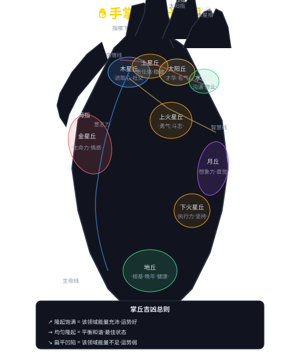

# 第八章 手相基础与掌形

## 8.1 手掌五行分类

手形分为五种基本类型，对应五行。看看你的手属于哪种？

| 五行 | 掌形特征 | 手感 | 性格特点 | 适合职业 |
|------|---------|------|---------|---------|
| 🌲**木** | 手指修长·骨节分明·掌呈长方形 | 有弹性·温度适中 | 条理分明·善分析·追求完美 | 教师·学者·设计师·律师 |
| 🔥**火** | 指尖呈锥·掌红润·指甲短宽 | 温暖偏热·光滑细腻 | 热情外向·行动力强·有创造力 | 销售·演员·讲师·媒体 |
| ⛰️**土** | 掌方方正·指粗短·掌色偏黄 | 厚实有力·适中偏凉 | 稳重可靠·务实·责任感强 | 管理者·工程师·公务员 |
| ⚔️**金** | 掌方正骨感·关节突出·掌色偏白 | 较坚硬·握力强 | 果断公正·有组织力·执行力强 | 法官·军人·外科医生 |
| 💧**水** | 掌柔软·线条圆润·掌色偏暗 | 极为柔软·湿冷 | 灵活变通·直觉敏锐·善交际 | 艺术家·心理咨询·外交 |

> **混合型最普遍**：大多数人同时具有2-3种手形特征，以最突出的一种为主。

## 8.2 手掌九丘详解

> 
> *上图标注了手掌的9个主要丘位和3条主线*

**掌丘吉凶判断原则**：
- **隆起饱满**=该领域能量充沛·运势好
- **均衡隆起**=和谐平衡·最佳状态
- **扁平凹陷**=该领域能量不足·运势弱

### 九丘速查表

| 掌丘 | 位置 | 对应卦 | 隆起为吉 | 扁平为凶 |
|------|------|--------|---------|---------|
| 木星丘 | 食指根下 | ☴巽 | 进取心强·社交好 | 缺乏动力·不善交际 |
| 土星丘 | 中指根下 | ☲离 | 稳重可靠·有担当 | 不负责任·不可靠 |
| 太阳丘 | 无名指根下 | ☷坤 | 才华出众·易出名 | 缺乏创意·默默无闻 |
| 水星丘 | 小指根下 | ☱兑 | 口才好·商业头脑 | 不善表达·社交弱 |
| 金星丘 | 拇指根下 | ☶艮 | 生命力旺盛·情感丰富 | 精力不足·情感淡漠 |
| 月丘 | 掌外缘下 | ☰乾 | 想象力丰富·艺术感 | 缺乏灵感·感知弱 |
| 上火星丘 | 掌心上外侧 | — | 有勇气·果断 | 容易退缩 |
| 下火星丘 | 掌心下外侧 | — | 有耐力·能坚持 | 缺乏毅力 |
| 地丘 | 掌根中部 | ☵坎 | 根基稳固·晚年安康 | 根基不稳·变动多 |

## 8.3 五指的含义与观察

五指各有含义，占手相分析重量的约25%：

| 手指 | 名称 | 含义 | 修长为吉 | 修短为凶 |
|------|------|------|---------|---------|
| 👍拇指 | 金星指 | 意志力·决断力 | 毅力强·有领导力 | 优柔寡断 |
| ☝食指 | 木星指 | 进取心·野心 | 有目标·不甘后人 | 安于现状 |
| 🖕中指 | 土星指 | 责任感·稳重 | 稳重可靠·有担当 | 不够负责 |
| 🖖无名指 | 太阳指 | 创造力·审美 | 艺术天赋高·创造力强 | 创意不足 |
| 🤙小指 | 水星指 | 沟通力·智慧 | 口才好·善于交际 | 不善表达 |

**手指间距**：
- 手指自然分开、缝明显 → 性格直率·不拘小节
- 手指自然并拢、无缝 → 性格谨慎·精打细算

**弹性测试**：
- 手指可后弯45°以上 → 随和·适应力强
- 手指僵硬不能弯 → 固执·原则性强

## 8.4 掌色与健康运势

掌色是手相中变化最快的指标，反映近期运势和健康状态：

| 掌色 | 健康提示 | 运势提示 | 建议 |
|------|---------|---------|------|
| 🟤红润 | 气血充足·健康 | 运势顺畅·做事顺利 | 保持状态 |
| ⚪苍白 | 气血不足·疲劳·贫血 | 运气低迷·力不从心 | 补气血·注意休息 |
| 🔴赤红 | 心火旺盛·血压偏高 | 情绪激动·投资冲动 | 降火·冷静决策 |
| 🟡发黄 | 脾胃不佳·肝胆弱 | 财运受阻·做事不顺 | 调整饮食·调理脾胃 |
| 🔵发青 | 气滞血瘀·肝胆郁结 | 运气受阻·心情压抑 | 增加运动·疏解压力 |
| ⚫晦暗 | 气血亏损·过度透支 | 运势低迷（最不利） | 保证睡眠·全面调养 |

> **健康掌色标准**：掌心微红润泽·掌丘红润·颜色均匀有光泽·温暖有弹性

## 8.5 手温·软硬·性格

| 维度 | 状态 | 对应性格 |
|------|------|---------|
| 🔥手温 | 热 | 热情·主动·易急躁 |
| 🌡️ | 正常 | **平和·动静得宜 ✅** |
| ❄️ | 冷 | 内敛·被动·社交偏弱 |
| 💫软硬 | 软 | 随和·适应力强，但可能无原则 |
| 💪 | 中等 | **刚柔并济 ✅** |
| 🪨 | 硬 | 意志坚强·固执·不变通 |
| 💧湿度 | 干暖 | 开朗热情·人缘好 |
| 💧 | 干冷 | 内向保守 |
| 💧 | 湿暖 | 热情易激动·情绪化 |
| 💧 | 湿冷 | 敏感·易紧张·焦虑 |

## 8.6 手相观察四步法

> **第1步：定掌形** → 观整体（大小·厚薄·软硬·五行分类）
>
> **第2步：看掌丘** → 观局部（九丘隆起·颜色·弹性·纹路）
>
> **第3步：察掌色** → 观状态（掌心色·掌丘色·温度湿度）
>
> **第4步：读掌纹** → 观细节（三大主线·次要纹路·特殊标记）

---

**参考文献**：
- [1] 麻衣道者. 麻衣相法[M]. 北京：中华书局，2008.
- [2] 相理衡真·手纹篇[M]. 台北：武陵出版社，2000.
- [3] 黄帝内经·灵枢[M]. 北京：人民卫生出版社，2005.
- [4] 陈抟. 河洛理数[M]. 北京：中华书局，1998.

**致谢**：感谢历代手相学者的传承和创新。
