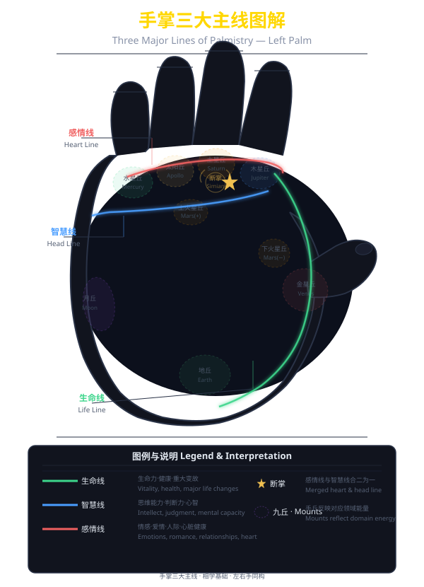

# 第九章 手相三大主线

## 9.1 三大主线概述

> 
> *上图展示了手掌三大主线（生命线·智慧线·感情线）的典型走向和九丘分布。不同颜色区分各主线，阴影区域标注九丘位置。*

手掌中的三大主线——生命线、智慧线和感情线——是手相学中最基本、最重要的纹路。这三条线几乎存在于每个人的手掌上，它们的形态、走向、深浅、长度和分支，蕴含着关于一个人的健康、智慧和情感的最基本信息。

### 9.1.1 三大主线的位置

**生命线**：起点在食指与拇指之间（木星丘与金星丘之间），呈弧线形围绕金星丘（拇指根部）延伸至手腕方向。生命线代表一个人的生命力、健康状态和人生轨迹的大致走向。

**智慧线**：起点与生命线相同或接近（食指与拇指之间），横过手掌中央指向月丘方向。智慧线代表一个人的智力水平、思维方式、学习能力和创造力。

**感情线**：起点在小指根部下方（水星丘区域），横过手掌上方，走向食指或中指根部。感情线代表一个人的情感世界、爱情观、人际关系和审美倾向。

### 9.1.2 三大主线的相互关系

三大主线之间并不是孤立存在的，它们之间有着密切的关联：

**起点关系**：生命线与智慧线通常同起点（或非常接近），但二者的分离程度会反映一个人的性格特征。生命线与智慧线起点重合较长的人谨慎小心；起点就分开的人果断大胆。

**走向关系**：智慧线的走向会影响生命线的形态——智慧线下垂（走向月丘）的人更富于想象力；智慧线平直（横贯手掌）的人更加务实理性。

**终点的呼应**：感情线的终点（走向食指或中指）与智慧线的终点（走向月丘或掌心）之间存在呼应——感情线止于食指的人重情义、感性；止于中指的人理性、克制。

## 9.2 生命线

### 9.2.1 生命线的形态含义

生命线是最常被人们提及的掌纹，但它并不直接代表"寿命的长短"——这是最常见的误解。实际上，生命线主要反映的是一个人的生命力（Vitality）——即精力水平、身体抵抗力和生活质量。

**线条深长清晰**：生命力旺盛，身体健康，精力充沛。这样的人抵抗力强，即使生病也容易恢复。线深长而流畅者，生活质量高、精力分配合理。

**线条浅短模糊**：精力相对不足，先天体质较弱。但需要注意的是，生命线的长短并不直接对应寿命长短——短而深的生命线并不代表早逝，而是可能代表精力集中、专注。

**线条粗大深重**：性格刚烈、精力过剩，容易过度消耗体力。

**线条纤细柔弱**：性格文弱、敏感，体力上不够充沛。

**双重生命线**（一条主线旁有一条平行的辅助线）：这是非常有利的相征，代表双倍的生命力、充沛的能量储备，甚至象征着"贵人扶持"或在重大疾病后的康复。

**生命线中断**：
- 中断处有搭桥线连接：虽有重大疾病或变故，但能够化险为夷
- 中断处无连接线：可能遭遇较大的健康或生活变故
- 中断后线条变弱：变故后精力大不如前
- 中断后线条变强：经历变故后反而更加坚强

### 9.2.2 生命线的分支与走向

**上升分支**（从生命线向上延伸的分支）：代表积极向上的变化——向上的分支通常与事业的上升期、财运的增加有关。

**下降分支**（从生命线向下延伸的分支）：代表精力的消耗或面对挑战——下降分支通常与精力透支、情绪低迷相关。

**锁链状生命线**：线条呈串珠状或锁链状，代表人生多波折、身体状况时有起伏。

**流星状分支**（生命线上有放射状的细小分支）：代表精力被分散到多个方向，可能同时从事多项事务。

**生命线过长**（延伸到手腕以下）：精力极其充沛，但也可能代表不安分、难以安定。

**生命线过短**（只到手掌中部）：并不代表早逝，而是可能精力相对集中，不太喜欢过多的体力活动。

### 9.2.3 生命线上的特殊标记

**岛纹**（线条上出现的小圈或椭圆）：代表精力消耗或身体状态的波动期，出现的具体位置对应不同年龄。

**十字纹**：代表危险或重大事件，具体含义需结合十字纹在生命线上的位置来判断。

**星纹**：代表突发的事故或意外。出现在生命线上的星纹比出现在其他位置的星纹更为凶险。

**方格纹**：代表保护或限制。出现在生命线上的方格纹通常意味着在某个阶段受到了保护或主动限制了自己的活动范围。

### 9.2.4 生命线的流年判断

生命线可以被划分出不同的年龄段。通常的划分方法是从生命线起点（食指与拇指之间）到生命线终点（手腕方向），等分为70-80个刻度，每个刻度约等于一年。具体判断时可以参考以下几个关键节点：

**起点到中点**（约40岁左右）：这段弧线最陡的部分代表中青年时期，线条的形态最能反映这一时期的精力状况。

**中点到后段**：后半段的线条反映中老年时期的健康趋势。后半段变浅是正常的生理老化现象，但如果后半变得极其模糊或中断，则需要注意。

**终点区域**（靠近手腕部分）：代表晚年的精力储备。终点向上弯向拇指为吉，向下指向掌根中正为吉。

## 9.3 智慧线

### 9.3.1 智慧线的形态含义

智慧线（又称"头脑线"）是三大主线中最能反映一个人思维能力、学习方式和决策风格的线条。智慧线横贯掌中，连接理性与感性、逻辑与直觉。

**长而清晰的智慧线**（横贯大部分手掌，甚至延伸到月丘）：思维清晰、逻辑严密，有较强的分析能力和记忆力。过长（延伸到手掌边缘）则可能过于理性、缺乏容忍度。

**短而清晰的智慧线**（只到手掌中部）：思维直接、务实、不易被复杂问题困扰。短不代表智力不足，而是思维方式更加精准果断。

**下垂的智慧线**（走向月丘）：想象力丰富、有创造力和艺术天赋，但也可能思维跳跃、不够逻辑。

**平直的智慧线**（横向走向、不偏不倚）：务实、理性、逻辑性强，适合做精密或需要条理性的工作。

**下弯幅度大的智慧线**（深深弯向月丘）：想象力极其丰富甚至不切实际，适合从事艺术创作。

**双智慧线**：两条独立的智慧线，代表极强的思维能力和多方面的才华，但也可能思维分裂、内心矛盾。

### 9.3.2 智慧线的分支与特殊形态

**清晰的上升支线**（从智慧线向上方手掌延伸）：事业和智慧向着积极的方向发展，善于学习新知识。

**下降支线**（从智慧线向下延伸）：代表在某些领域的专注深入，但过分下沉则可能钻牛角尖。

**智慧线末端分叉**（"叉纹"）：代表思维灵活、多才多艺。如果是"三叉纹"（三个分支），则是思维极其活跃的象征，但也可能代表注意力分散。

**岛纹出现在智慧线中段**：代表思维混乱、压力大的时期，常见于高压力工作的人。

**智慧线上出现十字纹**：代表思维和决策上的关键时刻——可能是人生的重要抉择。

**智慧线断续**：思维不连贯，或在不同年龄段思维方式发生过重大改变。

**链条状智慧线**：心胸细腻、敏感，容易受到外界影响而导致思维不定。

### 9.3.3 智慧线的起点分析

智慧线的起点与生命线的关系非常重要：

**起点与生命线完全重合**（一段距离后才分离）：代表谨慎、保守，做事前会深思熟虑。重合同样代表思维的稳定性——这种人做事有始有终。

**起点与生命线很接近但不重合**：平衡型——既有理性思考又有直觉勇气。

**起点与生命线明显分开**：果断、大胆、独立性强。分开的距离越大，行动力越强，但也可能越冲动。

**智慧线起点位于生命线之上（更靠近手指）**：代表特别的谨慎，甚至过于敏感。

**智慧线起点位于生命线之下（更靠近掌心）**：代表思路敏捷，行动快于思考。

### 9.3.4 智慧线的特殊类型

**猿猿纹（断掌）**：智慧线与感情线合二为一，横贯手掌形成一条深线。断掌的人意志力极强、性格极端、做事专注但又容易走极端。断掌者不论男女，往往在某个领域有非凡的成就。

**悉尼线**：智慧线横贯整个手掌（从内侧到外侧边缘）。这样的人思维极其开阔、多才多艺，但也容易分散精力。

**聪明线**：智慧线末端向月丘延伸并有一个小分叉，如同一个"鸟嘴"。这是传统手相学中公认的"聪明线"，代表思维灵活、善于推理。

## 9.4 感情线

### 9.4.1 感情线的形态含义

感情线（又称"心线"）反映一个人的情感世界——包括爱情观、亲情观、友情观，以及对美和艺术的感受力。

**深长清晰的感情线**：情感丰富、表达直接、有强烈的爱憎。这种人敢爱敢恨，对自己在意的人极其用心。

**浅短模糊的感情线**：情感内敛、不太擅长表达自己的感情。但这并不代表没有感情，只是表达方式更加含蓄。

**长感情线**（延伸到食指根部）：极其重视感情，愿意为爱人和亲人付出一切。但也容易在感情中过于投入。

**短感情线**（只延伸到中指下方）：感情独立，不会轻易为情所困，更注重理性和个人空间。

### 9.4.2 感情线的走向与终点

**终点在食指与中指之间**：理想型——感情与理性平衡，既有真挚的情感，又能保持理智。这是最理想的感情线终点。

**终点在食指根部**：感性主导——极其重视感情，在爱情中容易付出一切。这类人恋爱中容易受伤。

**终点在中指根部**：理性为主——感情中保持冷静克制，不太容易动真情。这类人在感情中比较谨慎。

**感情线平直（不弯曲）**：情感较为平淡，但持久稳定，不太容易被激情冲昏头脑。

**感情线末端上翘**：积极乐观的感情态度，对未来伴侣充满期待。

**感情线末端下垂**：可能在感情中有过受伤经历，对感情持悲观态度。

### 9.4.3 感情线的分支与特殊形态

**感情线上的上升支线**（向手指方向延伸）：代表在感情和人际关系中有积极的投入和发展。上升支线的数量和强度反映了一个人在社交中的活跃程度。

**感情线上的下降支线**（向掌心方向延伸）：代表感情上的波折或为感情做出的牺牲。下降到智慧线附近，则可能代表"因感情耽误事业发展"。

**感情线末端分叉**（"叉纹"）：代表复杂的感情经历或感情生活中的不同选择。

**岛纹出现在感情线上**：代表感情波折期——可能是恋爱失败、夫妻不和或者情感上的挣扎期。岛纹出现在感情线的前段（靠近小指）代表青年时期的感情波动；出现在后段（靠近食指）代表中年以后的感情变化。

**锁链状感情线**：情感丰富但也容易变化。这种人在感情中投入且感性，但也容易移情别恋。

**感情线中断**：
- 中断处有搭桥线：经历了感情挫折后能够重拾幸福
- 中断处无连接：感情上的重大断裂

### 9.4.4 感情线的特殊类型

**双重感情线**：两条平行的感情线，代表极其丰富的情感世界，但也可能感情对象较多。

**感情线与智慧线之间有连接线**：代表"感情与理智的斗争"——常常在感情和理性之间纠结。

**感情线上有星纹**：感情上可能有突发事件——好的方面是一见钟情；坏的方面是感情上遭遇意外打击。

**感情线过大过长**（占据整个手掌上半部分）：感情极其冲动，可能会因感情问题影响到生活的其他方面。

## 9.5 三大主线的综合判断

### 9.5.1 三大主线的配合度

一个好的手相是三大主线配合协调、相得益彰：

**生命线好·智慧线好·感情线好**：最理想的状态——生命力充沛、思维清晰、情感丰富。这样的人身心健康、事业有成、感情美满。

**生命线强·智慧线弱·感情线强**：精力旺盛、情感丰富但思考不足。容易因冲动而做出错误决策。

**生命线弱·智慧线强·感情线弱**：智力和思维方面突出，但体力和情感表达上有所欠缺。适合从事脑力劳动。

**生命线强·智慧线强·感情线弱**：身心能力平衡，干劲十足，但人与人之间的情感交流比较冷。事业发展顺利但家庭和感情生活较为平淡。

**三条线都不清晰**：可能是天生的细腻皮肤类型，不一定是坏事。需要结合手背的皮肤纹理综合判断。

### 9.5.2 三角区（火星平原）

三大主线在手掌中围成的区域称为"火星平原"（或"掌心三角"）。这个区域的大小和形态也有重要的相学意义：

**掌心中的三角区饱满**：精力充沛、积极进取、做事有冲劲。

**三角区扁平**：消极、精力不足、倾向于保守被动。

**三角区过大**（三大主线过于分散）：精力分散，可能同时从事多项工作但不够专注。

**三角区过小**（三大主线过于集中）：专注、精力集中，但也可能视野狭窄、过于专注一两件事而忽略全局。

## 9.6 三大主线的变化规律

### 9.6.1 主线的年龄变化

三大主线并不是一成不变的，它们会随着人的年龄和经历而变化：

**少年时期**（15岁前）：生命线最明显，智慧线和感情线尚未完全定型。此时主要观察生命线来判断先天体质。

**青年时期**（15-30岁）：智慧线逐渐成为主导。此阶段人的学习能力和思维方式是最活跃的，智慧线的变化最为明显。

**中年时期**（30-50岁）：三大主线基本定型。但感情的波折（感情线）、事业的起伏（智慧线）以及健康的困扰（生命线）都会在主线上留下"痕迹"。

**中老年时期**（50岁以后）：生命线的重要性再次凸显。此阶段生命线的深浅变化最能反映健康状态的变化。

### 9.6.2 主线的优化与改善

手相学家普遍认为，通过长期的努力和修炼，可以"改变"某些掌纹：

**生命线的改善**：通过规律的运动、健康的饮食、良好的作息来增强体质，可以使生命线变得更清晰或出现辅助线。

**智慧线的改善**：通过持续学习、阅读和思考来提升智慧，可以使智慧线变得更深更清晰。

**感情线的改善**：通过自我觉察、情感疗愈和改善人际关系，可以"修复"或"延展"感情线上曾经出现的破损。

### 9.6.3 左右手的差异分析

**左手反映先天**：左手的主线代表与生俱来的性格、倾向和潜力。

**右手反映后天**：右手的主线代表后天成长、经历和自我塑造的成果。

**双手一致**：代表天性纯真、表里如一、前后一致。可能是好事（保持一致性和真实性），也可能不太灵活。

**右手比左手好**：这是最有利的情况——代表通过后天的努力，改善了自己与生俱来的不足。

**左手比右手好**：代表后天的选择和环境没有让一个人的潜力得到充分展现。需要反思自己的生活方式和方向是否正确。

## 本章小结

三大主线是手相学中最核心的分析内容。本章详细介绍了生命线、智慧线和感情线的形态特征、走向含义、分支变化和特殊标记，并分析了三大主线之间的配合关系。

需要再次强调：生命线的长短并不直接决定寿命的长短。三大主线反映的是人的"生命力"、"思维力"和"情感力"三个维度的特征和趋势——它们既不是宿命的判决书，也不是一成不变的标签。通过自我认知和生活方式调整，人们可以在一定程度上"优化"自己的掌纹。

在下一章中，我们将探讨手相学中的次要纹路——事业线、财运线、成功线、婚姻线等，以及手相九丘的详细分析方法。

---

**参考文献**：

- [1] 麻衣道者. 麻衣相法[M]. 北京：中华书局，2008.
- [2] 相理衡真·手纹篇[M]. 台北：武陵出版社，2000.
- [3] 神相全编[M]. 北京：北京图书馆出版社，2003.
- [4] 袁天纲. 袁天纲相法[M]. 台北：武陵出版社，1995.
- [5] 林之满. 中华相术大全[M]. 北京：华龄出版社，2005.
- [6] 王充. 论衡[M]. 上海：上海古籍出版社，2010.
- [7] 黄帝内经·灵枢[M]. 北京：人民卫生出版社，2005.
- [8] 张介宾. 类经图翼[M]. 北京：人民卫生出版社，1983.
- [9] 陈抟. 河洛理数[M]. 北京：中华书局，1998.
- [10] 相理衡真·气色篇[M]. 台北：武陵出版社，2000.

**致谢**：

三大主线作为手相学最基础的分析框架，凝聚了历代手相学者的智慧和经验。感谢所有为手相学传承做出贡献的先贤们。特别要强调的是，手相学是一门经验性学科，关于三大主线的解释在不同的流派中可能存在差异，读者应当以开放的态度学习，并在实践中积累经验。欢迎提出宝贵意见。

---

📚 下一章预告：第十章·手相九丘与次要线纹——深入讲解事业线、财运线、婚姻线、太阳线等重要辅助纹路，以及九丘的详细分析方法和综合判断。
