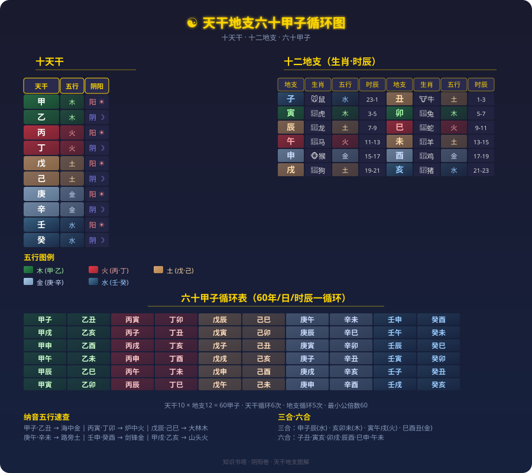

# 第十二章 八字基础与命理入门

## 12.1 八字命理的基本概念

八字命理，又称"四柱预测学"，是中国传统命理学的核心内容。八字是一个人出生年、月、日、时的天干地支组合，共四个时间单位、八个字，故称"八字"。八字命理通过分析这八个字之间的阴阳五行生克制化关系，来推测一个人的性格特质、人生运势和命运轨迹。

### 12.1.1 四柱的构成

八字由四柱组成：
- **年柱**：出生年份的天干地支
- **月柱**：出生月份的天干地支
- **日柱**：出生日的天干地支（日柱的"天干"也叫"日元"或"日主"，是八字分析的中心）
- **时柱**：出生时辰的天干地支

将"年、月、日、时"四柱的干支排列出来，共八个字，即是"八字"。

### 12.1.2 八字与相学的关系

八字命理与手面相学有着密切的内在联系：

**八字反映先天**：八字是一个人的"先天命盘"，反映出生的时空能量配置，是命理分析的基础。

**面相反映后天**：面相是一个人先天禀赋加上后天修为的综合体现，是"命"与"运"结合的产物。

**手相反映当下**：手相是一个人当前状态和近期运势最灵敏的反映。

**互补关系**：八字命理可以揭示一个人一生的命运走向和大运趋势，而手面相则能验证和补充八字判断，两者互为印证。

> 
> *上图完整展示了十天干与十二地支的五行属性、生肖时辰对应和六十甲子循环。天干×地支=60甲子，是八字排盘的基础工具。天干以10年为一旬，地支以12年为一轮，每60年完成一个完整的甲子循环。*

## 12.2 排盘方法

### 12.2.1 年柱的推算

年柱的确定比较简单。以立春为分界：立春之前出生属于前一年，立春之后出生属于当年。农历以立春为一年的开始。

例如，2026年2月4日立春。在2月4日之前出生的人年柱为乙巳年（2025年），2月4日（含）之后出生的人年柱为丙午年（2026年）。

### 12.2.2 月柱的推算

月柱的天干需要根据年柱的天干来推算，地支每年固定不变（正月寅、二月卯、三月辰……十二月丑）。推算月干的口诀是"五虎遁"：

**甲己之年丙作首**：甲年和己年的正月是丙寅
**乙庚之岁戊为头**：乙年和庚年的正月是戊寅
**丙辛之年寻庚上**：丙年和辛年的正月是庚寅
**丁壬壬寅顺水流**：丁年和壬年的正月是壬寅
**戊癸甲寅之上好追求**：戊年和癸年的正月是甲寅

例如，2026年为丙午年，根据"丙辛之年寻庚上"，正月为庚寅月，二月为辛卯月，以此类推。

### 12.2.3 日柱的推算

日柱的计算相对复杂，需要已知某个特定日期的干支，然后以此为准推算目标日期的干支。目前最简便的方法是使用万年历或手机软件直接查询。

### 12.2.4 时柱的推算

时柱的地支固定不变（23-1点为子时，1-3点为丑时……），天干需要根据日柱的天干（日干）来推算。推算时干的口诀是"五鼠遁"：

**甲己还加甲**：甲日和己日的子时为甲子
**乙庚丙作初**：乙日和庚日的子时为丙子
**丙辛从戊起**：丙日和辛日的子时为戊子
**丁壬庚子居**：丁日和壬日的子时为庚子
**戊癸何方发，壬子是真途**：戊日和癸日的子时为壬子

例如，日干为丙（丙午日），根据"丙辛从戊起"，子时为戊子时，丑时为己丑时，以此类推。

## 12.3 十神分析

十神是八字命理的核心分析框架之一，将日干（日元）与其他七个干支的关系分为十种类型。每种十神代表一种特定的人际关系、性格特质和生活领域。

### 12.3.1 十神的基本分类

以日干的"我"为中心，与其他干支的五行关系分为生克两途、阴阳两义，共有十种：

**正印**：生我且阴阳相反，如甲日见癸（阳甲遇阴癸）。代表慈爱、学习、长辈、学历。正印旺的人有文化、有教养、心地善良。

**偏印**：生我且阴阳相同，如甲日见壬（阳甲遇阳壬）。代表非正统的学习能力、特殊技能、第六感。偏印旺的人思维独特、有创造力。

**正官**：克我且阴阳相反，如甲日见辛（阳甲遇阴辛）。代表责任心、事业、权力、配偶（女性）。正官旺的人正直、守规矩、有领导力。

**七杀（偏官）**：克我且阴阳相同，如甲日见庚（阳甲遇阳庚）。代表压力、竞争、魄力、变革。七杀旺的人有闯劲、敢作敢为但压力大。

**正财**：我克且阴阳相反，如甲日见己（阳甲遇阴土）。代表正当的工资收入、稳定财运、妻子（男性）。正财旺的人务实、节俭、善于积累财富。

**偏财**：我克且阴阳相同，如甲日见戊（阳甲遇阳土）。代表意外之财、投资收益、父亲、慷慨。偏财旺的人大方、善于投资、有经商头脑。

**比肩**：与我五行相同且阴阳相同，如甲日见甲。代表自我、兄弟、朋友、同事。比肩旺的人独立、有主见、但可能竞争意识强。

**劫财**：与我五行相同而阴阳相反，如甲日见乙。代表兄弟姐妹、朋友、同事，但偏向竞争关系。劫财旺的人朋友多但容易被朋友拖累。

**食神**：我生且阴阳相同，如甲日见丙（阳甲生阳丙）。代表才华、表现力、口福、享受。食神旺的人有才艺、乐观豁达、有口福。

**伤官**：我生且阴阳相反，如甲日见丁（阳甲生阴丁）。代表才华、叛逆、创新、口舌。伤官旺的人聪明有才华但不守常规、容易得罪人。

### 12.3.2 十神在面相中的体现

十神所代表的性格特质可以通过面相得到印证：

- 正印旺者：额头饱满、眉目慈祥、气质文雅
- 偏印旺者：眼神深邃、轮廓独特、气质不凡
- 正官旺者：气势端庄、鼻梁正直、法令纹清晰
- 七杀旺者：颧骨高耸、眼神锐利、气质强势
- 正财旺者：鼻头圆润、下巴饱满、面色黄润
- 偏财旺者：鼻翼丰满、耳垂厚实、嘴角上扬
- 比肩旺者：骨架粗壮、肩宽背厚、面相硬朗
- 劫财旺者：颧骨外张、下巴有力、眼神争强
- 食神旺者：面色红润、唇厚丰满、笑容温和
- 伤官旺者：眼神灵动、唇形优美、气质清秀

## 12.4 大运与流年

### 12.4.1 大运的基本概念

大运是八字命理中的一种十年运势系统。每个人从出生开始，每隔十年进入一个大运，大运的天干地支反映了该十年期间的运势走向。

男命阳年（甲丙戊庚壬年）和女命阴年（乙丁己辛癸年）大运顺排（从月柱的下一个节气开始）；男命阴年和女命阳年大运逆排（从月柱的上一个节气开始）。

### 12.4.2 大运与面相的关系

大运的吉凶与面相的流年分析相互配合：
- 好的大运期间，面部气色往往明润有光泽
- 差的大运期间，面部气色往往晦暗或有异常色
- 大运的五行与面相的五行相生者运势顺畅
- 大运的五行与面相的五行相克者运势受阻

### 12.4.3 流年的基本概念

流年是指每一年的运势。流年由当年的干支决定，例如2026年为丙午年。流年对八字格局的影响主要通过刑冲合害等方式实现。

## 12.5 八字与手面相的配合分析

### 12.5.1 八字与面相的印验

八字和面相相互印验可以帮助命理师验证判断的准确性：

**八字中的正官 vs 面相中的官禄宫**：
- 八字正官为用神且有力，面相官禄宫应饱满明亮
- 如果八字正官好但官禄宫差，可能代表官运有阻

**八字中的正财 vs 面相中的财帛宫**：
- 八字正财旺盛，面相鼻头应圆润饱满
- 八字财旺但鼻相差，可能"富屋穷人"——有财但不会理财

### 12.5.2 八字与手相的配合

**八字中的比劫（比肩劫财）和手相中的生命线**：
- 比劫旺的手生命线应该深长有力
- 如果比劫旺但生命线弱，需注意健康管理和人际协调

**八字中的食伤（食神伤官）和手相中的智慧线**：
- 食伤旺的手智慧线应该长而清晰
- 智慧线的形态可以验证八字中"才华"的表达方式

**八字中的财星和手相中的财运线**：
- 财星旺的手应有清晰的财运线

### 12.5.3 综合分析的步骤

第一步：排八字、定格局。确定日主旺衰、五行平衡度、用神忌神。

第二步：看面相、验格局。对照面部特征验证八字的判断。

第三步：看手相、查细节。通过手纹验证八字中的具体事件和领域。

第四步：结合大运流年。判断当前所处的运势阶段，给出前瞻性建议。

## 12.6 十天干详解

天干是中国传统历法中表示时间序列的十个符号，分别为甲、乙、丙、丁、戊、己、庚、辛、壬、癸。十天干源自古代天文学对太阳运行周期的观测，代表着宇宙能量的十种不同状态。在八字命理中，十天干是构成八字的最基本元素之一，每个天干都有其独特的五行属性、阴阳属性和象征意义。十天干与五方、五季、五脏、五色等都有对应关系，形成了一个庞大而系统的符号体系。

### 12.6.1 十天干五行属性总表

十天干按五行分为五组，每组一阴一阳：

| 天干 | 五行 | 阴阳 | 方位 | 季节 | 五脏 | 五色 | 象征 |
|------|------|------|------|------|------|------|------|
| 甲 | 木 | 阳 | 东方 | 春季 | 胆 | 青绿 | 参天大树，栋梁之材 |
| 乙 | 木 | 阴 | 东方 | 春季 | 肝 | 青绿 | 花草藤蔓，柔韧之木 |
| 丙 | 火 | 阳 | 南方 | 夏季 | 小肠 | 赤红 | 太阳之火，光明热烈 |
| 丁 | 火 | 阴 | 南方 | 夏季 | 心 | 赤红 | 灯火之火，温暖柔和 |
| 戊 | 土 | 阳 | 中央 | 季夏 | 胃 | 棕黄 | 城墙之土，厚重稳固 |
| 己 | 土 | 阴 | 中央 | 季夏 | 脾 | 棕黄 | 田园之土，滋养万物 |
| 庚 | 金 | 阳 | 西方 | 秋季 | 大肠 | 白 | 刀剑之金，刚锐肃杀 |
| 辛 | 金 | 阴 | 西方 | 秋季 | 肺 | 白 | 珠玉之金，精致华丽 |
| 壬 | 水 | 阳 | 北方 | 冬季 | 膀胱 | 黑蓝 | 江河之水，浩瀚奔流 |
| 癸 | 水 | 阴 | 北方 | 冬季 | 肾 | 黑蓝 | 雨露之水，细腻滋润 |

### 12.6.2 甲木详解

**甲木**为阳木，象征参天大树、栋梁之材。甲木之人的核心特质是刚直、大气、有担当。甲木在十天干中排首位，代表着创始力和领导力。

**性格特质**：甲木之人通常身材挺拔、气质正直，为人光明磊落、有领导风范。他们如同大树一般，有强烈的成长欲望和向上精神，不怕困难、敢于担当。但甲木太过则显得固执己见、不够灵活，容易因为过于刚直而得罪人。甲木之人最看重的是尊严和原则，可以妥协但不会放弃底线。

**事业特质**：甲木之人适合做需要担当和领导力的工作。从政、管理、建筑、教育、军事等领域都能发挥甲木的特质。甲木有"栋梁"之喻，在团队中往往是核心人物或精神领袖。甲木若在八字中得令得地，加上好的辅助用神，必成大器。

**在面相上的体现**：甲木应于面上，额头高耸宽阔、鼻梁挺直有势、眉骨端正。面形偏长方，骨骼结构明显，整体呈现正直刚毅的气质。甲木旺的人，面部棱角分明，气质端方。

**在体形上的体现**：甲木之人身材通常高挑端正，肩宽背厚，站立时有种顶天立地的感觉。走路姿态稳健，步伐较大，给人稳重可靠之感。

**在健康上的提示**：甲木对应人体胆经和头部。甲木受损的人容易头痛、眩晕、肝胆功能失调。注意保持规律作息，避免熬夜伤肝。

### 12.6.3 乙木详解

**乙木**为阴木，象征花草藤蔓、柔韧之木。乙木之人的核心特质是灵活、适应力强、有韧性。乙木虽为阴柔之木，但其柔中带刚，韧劲十足。

**性格特质**：乙木之人如同藤蔓，善于借势、灵活应变。他们通常性格温和、善于交际、有很强的适应能力。乙木之人心思细腻，观察力敏锐，懂得审时度势。但乙木太过则显得软弱无主见、过分依赖他人。

**事业特质**：乙木之人适合从事需要耐心和细致的行业，如艺术创作、设计、文案、心理咨询、教育、外交等行业。乙木的柔韧性使其非常适合在复杂环境中周旋。

**在面相上的体现**：乙木应于面上，面形偏圆润或鹅蛋脸型，眉目清秀，气质柔和。面部线条流畅不突兀，整体呈现温婉可亲的感觉。

**在体形上的体现**：乙木之人身材属于中等或偏瘦类型，四肢修长但不如甲木者强壮。身体柔韧性好，姿态优雅从容。

**在健康上的提示**：乙木对应人体肝脏。乙木受损的人容易情绪抑郁、眼睛干涩、筋骨酸痛。注意情绪管理和适当运动。

### 12.6.4 丙火详解

**丙火**为阳火，象征太阳之火、光明热烈。丙火之人的核心特质是热情、开朗、有感染力。丙火代表着光明和温暖，如同太阳照耀万物。

**性格特质**：丙火之人热情洋溢、乐观向上，有很强的感染力和号召力。他们如同太阳一样，走到哪里就把光和热带到哪里。丙火之人慷慨大方、乐于助人，但太过则显得急躁冲动、不够沉稳。

**事业特质**：丙火之人适合从事需要热情和活力的工作，如演艺、演讲、销售、公关、传媒等行业。丙火的光明特性使其也非常适合教育、培训、公益等传递正能量的领域。

**在面相上的体现**：丙火应于面上，面色通常红润有光，眼睛明亮有神采，笑容灿烂。面部整体呈现热情洋溢的气质。丙火旺的人，面部气色总是红润光泽。

**在体形上的体现**：丙火之人身材通常比较匀称，不胖不瘦。体态充满活力，说话时手势丰富，表情生动，给人一种精力充沛的感觉。

**在健康上的提示**：丙火对应人体小肠和血液循环系统。丙火受损的人容易出现心血管问题、面色苍白、手脚冰凉。注意保持温暖，多晒太阳。

### 12.6.5 丁火详解

**丁火**为阴火，象征灯火之火、温暖柔和。丁火之人的核心特质是细腻、文雅、有内涵。丁火如同夜晚的烛光，温柔而恒久。

**性格特质**：丁火之人看似温和内敛，实则内心炽热。他们心思细腻、富有同情心，对美和艺术有独特的敏感度。丁火之人往往具有文艺气质，内心世界丰富。但丁火太过则容易多愁善感、精神内耗严重。

**事业特质**：丁火之人适合从事需要细腻感受力和创造力的工作，如文学创作、艺术设计、音乐、宗教、哲学研究等。丁火的灯烛之喻也适合从事照明、光学、能源等行业。

**在面相上的体现**：丁火应于面上，面形偏尖，下巴尖秀，眼睛秀美有神，气质灵动。整体带有一种文艺清秀的气质，给人优雅含蓄的感觉。

**在体形上的体现**：丁火之人身材往往偏瘦，气质文弱但精神集中。体态温柔安静，动作不疾不徐，给人一种沉稳而不沉闷的感觉。

**在健康上的提示**：丁火对应心脏和血液循环系统。丁火受损的人容易心悸、失眠、情绪波动大。注意劳逸结合，避免过度思虑。

### 12.6.6 戊土详解

**戊土**为阳土，象征城墙之土、厚重稳固。戊土之人的核心特质是稳重、可靠、有担当。戊土如同坚固的城墙，是支撑一切的基础。

**性格特质**：戊土之人稳重踏实、言出必行，是值得信赖的人。他们如同大地一样厚德载物，包容性强，能够承受压力。戊土的人做事有计划、有步骤，不喜欢冒进。但戊土太过则显得固执保守、缺乏变通。

**事业特质**：戊土之人适合从事需要稳重和可靠性的工作，如地产、建筑、农业、金融、行政管理等领域。戊土的城墙之质适合做守护和管理类工作。

**在面相上的体现**：戊土应于面上，面形方正宽阔，额头宽阔，鼻头圆润丰满。整体气质厚重端庄，给人踏实可靠之感。

**在体形上的体现**：戊土之人身材通常比较敦实，骨架大，肌肉结实。体格强健，动作稳重不轻浮，给人一种稳如泰山的感觉。

**在健康上的提示**：戊土对应脾胃和消化系统。戊土受损的人容易消化不良、胃部不适、身体沉重。注意饮食规律，少吃生冷食物。

### 12.6.7 己土详解

**己土**为阴土，象征田园之土、滋养万物。己土之人的核心特质是包容、平和、善滋养。己土如同肥沃的田园，默默滋养着万物生长。

**性格特质**：己土之人温和谦逊、善于包容协调。他们心思缜密、考虑周全，是优秀的聆听者和支持者。己土的人往往人缘好、容易相处。但己土太过则显得优柔寡断、缺乏主见。

**事业特质**：己土之人适合从事需要耐心和细致的工作，如医疗、护理、教育、公益、人力资源、后勤管理等领域。己土的田园之质也适合农业、园艺、环保等行业。

**在面相上的体现**：己土应于面上，面形偏圆，下巴圆润，五官分布和谐，整体给人亲切温和之感。面部线条柔和，没有尖锐感。

**在体形上的体现**：己土之人身材往往偏丰满或圆润，体态柔软，给人一种亲和亲近之感。坐姿和站姿都比较放松不紧绷。

**在健康上的提示**：己土对应脾脏。己土受损的人容易脾胃虚弱、气血不足、四肢无力。注意健脾养胃，适当运动。

### 12.6.8 庚金详解

**庚金**为阳金，象征刀剑之金、刚锐肃杀。庚金之人的核心特质是刚毅、果断、有魄力。庚金如同锋利的刀剑，锐不可当。

**性格特质**：庚金之人意志坚定、果敢决断、执行力强。他们如同刀剑般锐利，直指要害，不拖泥带水。庚金的人讲原则、重情义，但也容易因为过于刚直而伤及他人。庚金太过则显得冷酷无情、伤人伤己。

**事业特质**：庚金之人适合从事需要决断力和执行力的工作，如军队、警察、法律、技术工程、外科医生、金融投资等领域。庚金的刀剑之质也适合制造业、冶炼、机械等行业。

**在面相上的体现**：庚金应于面上，面形方正偏长，骨骼明显，棱角分明。眉浓而有力，眼神锐利坚定，鼻梁挺直。整体气质刚毅冷峻。

**在体形上的体现**：庚金之人身材通常骨架明显，肌肉线条分明，关节突出。体态挺拔有力，给人一种刚毅果决的感觉。

**在健康上的提示**：庚金对应大肠和呼吸系统。庚金受损的人容易便秘、皮肤问题、呼吸系统疾病。注意保持空气流通，多补水。

### 12.6.9 辛金详解

**辛金**为阴金，象征珠玉之金、精致华丽。辛金之人的核心特质是精致、优雅、有品味。辛金如同珍贵的珠宝，光芒内敛而华美。

**性格特质**：辛金之人追求完美、注重细节、审美能力出众。他们如同珠宝一般，经过打磨才能展现最美的光芒。辛金的人往往有艺术天赋，注重生活品质。但辛金太过则显得挑剔苛刻、过分注重外表。

**事业特质**：辛金之人适合从事需要精致和审美的工作，如珠宝设计、时尚、美容、音乐、精密仪器制造、会计审计等领域。辛金的珠玉之质也适合艺术品鉴赏、收藏等行业。

**在面相上的体现**：辛金应于面上，面形偏方或瓜子脸，皮肤白皙细腻，五官精致秀美，气质清雅脱俗。

**在体形上的体现**：辛金之人身材通常偏瘦，骨骼纤细但不柔弱。体态优雅，动作轻巧，给人一种精致灵秀的感觉。

**在健康上的提示**：辛金对应肺部和呼吸道。辛金受损的人容易咳嗽、哮喘、皮肤干燥。注意保湿润肺，避免干燥环境。

### 12.6.10 壬水详解

**壬水**为阳水，象征江河之水、浩瀚奔流。壬水之人的核心特质是智慧、变通、有格局。壬水如同大江大河，奔流不息、气势磅礴。

**性格特质**：壬水之人聪明睿智、思维开阔、善于变通。他们如同江河般能够适应各种环境，顺势而为。壬水的人有大局观，善于谋划。但壬水太过则显得心机深沉、难以捉摸、缺乏定性。

**事业特质**：壬水之人适合从事需要智慧和变通能力的工作，如商业贸易、物流交通、水利工程、咨询策划、互联网技术等领域。壬水的江河之质也适合旅游、外交等需要频繁流动的行业。

**在面相上的体现**：壬水应于面上，面形方圆适中，额头宽阔，眼睛深邃有神，鼻头圆润。整体气质灵动睿智，眼神中透露着智慧的锋芒。

**在体形上的体现**：壬水之人身材通常适中，身体比较柔韧灵活。动作流畅自然，给人一种灵活多变的感觉。

**在健康上的提示**：壬水对应膀胱和泌尿系统。壬水受损的人容易水肿、泌尿系统疾病、血压问题。注意肾脏保养，适当饮水。

### 12.6.11 癸水详解

**癸水**为阴水，象征雨露之水、细腻滋润。癸水之人的核心特质是细腻、敏感、有灵性。癸水如同清晨的露珠，晶莹剔透、润物无声。

**性格特质**：癸水之人心思细腻、敏感多思、直觉力强。他们如同雨露般细腻滋润，善于理解和包容他人。癸水的人往往有丰富的内心世界和强大的感知力。但癸水太过则显得多疑敏感、情绪化、过于内向。

**事业特质**：癸水之人适合从事需要细腻感受力和洞察力的工作，如心理咨询、灵性研究、文化艺术、科学研究、侦探推理等领域。癸水的雨露之质也适合环保、生态、养生等行业。

**在面相上的体现**：癸水应于面上，面形偏圆或椭圆，皮肤细腻有光泽，眼睛水润有神，嘴唇丰满。整体气质温柔含蓄，有一种温润如玉的感觉。

**在体形上的体现**：癸水之人身材往往比较柔软灵动，肌肉线条不明显但身体的柔韧性极好。体态温柔舒展，给人一种舒适安详的感觉。

**在健康上的提示**：癸水对应肾脏和内分泌系统。癸水受损的人容易肾虚、内分泌失调、记忆力衰退。注意作息规律，避免过度劳累。

## 12.7 十二地支详解

地支是中国传统历法中表示时间序列的十二个符号，分别为子、丑、寅、卯、辰、巳、午、未、申、酉、戌、亥。地支对应十二个月、十二个时辰和十二生肖，是八字命理中与天干并重的基本元素。每个地支都有其五行属性、三合六合关系、刑冲克害关系。

### 12.7.1 十二地支基本属性表

| 地支 | 生肖 | 五行 | 阴阳 | 方位 | 月份 | 时辰 |
|------|------|------|------|------|------|------|
| 子 | 鼠 | 水 | 阳 | 正北 | 十一月 | 23:00-01:00 |
| 丑 | 牛 | 土 | 阴 | 东北 | 十二月 | 01:00-03:00 |
| 寅 | 虎 | 木 | 阳 | 东北 | 正月 | 03:00-05:00 |
| 卯 | 兔 | 木 | 阴 | 正东 | 二月 | 05:00-07:00 |
| 辰 | 龙 | 土 | 阳 | 东南 | 三月 | 07:00-09:00 |
| 巳 | 蛇 | 火 | 阴 | 东南 | 四月 | 09:00-11:00 |
| 午 | 马 | 火 | 阳 | 正南 | 五月 | 11:00-13:00 |
| 未 | 羊 | 土 | 阴 | 西南 | 六月 | 13:00-15:00 |
| 申 | 猴 | 金 | 阳 | 西南 | 七月 | 15:00-17:00 |
| 酉 | 鸡 | 金 | 阴 | 正西 | 八月 | 17:00-19:00 |
| 戌 | 狗 | 土 | 阳 | 西北 | 九月 | 19:00-21:00 |
| 亥 | 猪 | 水 | 阴 | 西北 | 十月 | 21:00-23:00 |

### 12.7.2 地支的三合六合与刑冲克害

地支之间有着复杂的互动关系，这些关系在八字分析中至关重要。

**三合局**：三个地支相合形成强大的能量场。
- 申子辰合水局：代表智慧、流动、变化
- 亥卯未合木局：代表成长、创造、发展
- 寅午戌合火局：代表热情、活力、爆发力
- 巳酉丑合金局：代表决断、收敛、执行力

三合局的能量远大于单个地支。如果一个人的八字中有三合局，尤其是三合局中包含了日支或月支，这个人的某方面特质会非常突出。例如，申子辰水局的人思维敏捷、善于变通；寅午戌火局的人热情奔放、积极进取。

**六合**：两两相合，较为温和。
- 子丑合土
- 寅亥合木
- 卯戌合火
- 辰酉合金
- 巳申合水
- 午未合火土

六合代表和谐、合作、互补。在八字中，六合往往意味着某种关系的调和或能量的补充。例如，八字中夫妻宫被合，往往代表婚姻受外因影响。

**六冲**：直接对抗的关系。
- 子午冲：水火相战
- 丑未冲：土土相冲
- 寅申冲：金木相战
- 卯酉冲：金木相战
- 辰戌冲：土土相冲
- 巳亥冲：水火相战

六冲代表变动、冲突、分离。八字中带冲往往意味着人生多变动、有重大转折。冲的力量可以是破坏性的，但也可能是打破僵局、开创新局的契机。

**六害**：暗中相害的关系。
- 子未害：水被土克
- 丑午害：火土相害
- 寅巳害：木火相害
- 卯辰害：土木相害
- 申亥害：金水相害
- 酉戌害：金土相害

六害代表暗中阻碍、小人、背后是非。八字中带害的人需要注意人际关系中的隐患。

**三刑**：代表责难、伤害、疾病。
- 寅巳申无恩之刑
- 丑未戌恃势之刑
- 子卯无礼之刑
- 辰、午、酉、亥为自刑

### 12.7.3 地支藏干

每个地支内部都藏有若干天干，称为"藏干"。藏干标志着地支内部蕴含的多种能量，在八字分析中用于判断五行旺衰和十神关系。

| 地支 | 藏干 |
|------|------|
| 子 | 癸 |
| 丑 | 己、癸、辛 |
| 寅 | 甲、丙、戊 |
| 卯 | 乙 |
| 辰 | 戊、乙、癸 |
| 巳 | 丙、庚、戊 |
| 午 | 丁、己 |
| 未 | 己、丁、乙 |
| 申 | 庚、壬、戊 |
| 酉 | 辛 |
| 戌 | 戊、辛、丁 |
| 亥 | 壬、甲 |

地支藏干在八字分析中非常重要。例如，辰戌丑未四个土支中藏有多种五行，被称为"杂气"，使得土支具有多变性和复杂性。寅申巳亥四生支藏有本气、中气和余气三种成分，能量层次丰富。子卯酉四正支只藏本气，能量集中纯粹。

### 12.7.4 十二地支的性情

**子水**：聪明机智，灵活多变，但有时过于狡黠。子水之人思维敏捷，善于交际，但容易见风使舵。

**丑土**：踏实稳重，吃苦耐劳，但有时过于固执保守。丑土之人有耐心、有责任感，是可靠的朋友和同事。

**寅木**：积极进取，充满活力，但有时过于急躁。寅木之人有开创精神，敢于冒险，是天生的领导者。

**卯木**：温柔善良，心思细腻，但有时过于敏感。卯木之人富有同情心，善于照顾他人，有艺术天赋。

**辰土**：胸怀宽广，志向远大，但有时过于自负。辰土之人有统领能力，善于组织，是天生的管理者。

**巳火**：热情主动，行动力强，但有时过于冲动。巳火之人有冒险精神，善于应对突发情况。

**午火**：光明磊落，热情洋溢，但有时过于高调。午火之人有感染力，慷慨大方，是天生的社交高手。

**未土**：温和包容，善于协调，但有时优柔寡断。未土之人有奉献精神，善于调解矛盾。

**申金**：聪慧敏捷，能言善辩，但有时过于精明。申金之人学习能力强，适应能力出众。

**酉金**：精明细致，追求完美，但有时过于挑剔。酉金之人有审美天赋，做事一丝不苟。

**戌土**：忠诚可靠，刚正不阿，但有时过于固执。戌土之人有原则、有担当，是值得信赖的朋友。

**亥水**：包容豁达，随遇而安，但有时过于随意。亥水之人有智慧、有谋略，善于把握大局。

## 12.8 天干地支组合与性格

天干和地支的组合构成了六十甲子，每一种组合都有其独特的能量特质。在实际八字分析中，天干代表外在表现，地支代表内在本质。理解天干地支的组合关系，是把握一个人性格特质的关键。

### 12.8.1 天干与地支的相互作用

在八字中，天干和地支是一体的，天干为表、地支为里，天干显于外、地支藏于内。

**天干主导外在表现**：天干是命主的外在表现、社会形象和行动方式。人们通常看到的是一个人天干所代表的性格面。

**地支主导内在本质**：地支是命主的内在本质、潜意识、情感世界和真实想法。只有深入了解一个人，才能看到其地支所代表的性格面。

**透干与藏支**：一个五行如果在地支中强旺，同时在年、月、时三柱的天干中出现（叫"透干"），这个五行的力量就会最大限度地发挥出来。如果某五行只藏在地支中而无天干透出（叫"藏支"），则其能量较为内敛。

### 12.8.2 天干组合性格特征

**甲木+寅支**：甲木值寅月，为建禄之格，性格最为刚正不阿。这种人天生有领导风范，但须注意太过刚直的问题。木气旺盛，为人有正义感但不善于变通。

**乙木+卯支**：乙木值卯月，也是建禄格。这种人外表温和内心坚定，善于处理人际关系。但乙卯纯阴之木，容易走向另一个极端——过于脆弱敏感。

**丙火+午支**：丙火值午月，火旺至极。这种人热情似火光明磊落，但也容易因为太过热烈而烧灼他人。需要注意控制情绪，避免急躁冲动。

**庚金+申支**：庚金值申月，金气正盛。这种人大义凛然、言辞犀利、行动果断。但过于刚强容易伤及他人，需要阴柔五行的调和。

**壬水+亥支**：壬水值亥月，水势浩瀚。这种人智慧超群、善于谋划布局，但也容易因为过于灵活而缺乏原则。

**癸水+子支**：癸水值子月，水性最为纯净。这种人敏感细腻、直觉精准，有很强的感知力和领悟力，但也容易情绪波动。

### 12.8.3 常见干支组合与典型性格

**甲子日柱**：天干甲木坐于子水之上，水木相生。这种人外表刚直、内心聪慧，既有甲木的正直又有子水的灵活。但甲木被水浸泡过甚，容易意志不坚、多思少决。

**乙丑日柱**：天干乙木坐于丑土之上，木土相克。这种人外表温和内心固执，乙木的柔韧性被丑土所制约。性格中有一种内在的矛盾感，需要化解木土之克。

**丙寅日柱**：天干丙火坐于寅木之上，木火相生，能量极为充沛。这种人精力旺盛、进取心强，有如朝阳初升之势。但也容易过于急躁，需要培养耐心。

**丁卯日柱**：天干丁火坐于卯木之上，木火相生但为阴火。这种人外表冷静内心热情，有艺术天赋和创造力。但也容易敏感多思、精神内耗。

**戊辰日柱**：天干戊土坐于辰土之上，土气厚重至极。这种人极为稳重可靠，但也极为固执。一旦做出决定，几乎不可能被改变。

**己巳日柱**：天干己土坐于巳火之上，火土相生。这种人外表温和、内在精明，善于隐藏真实想法。己火相生使其有良好的学习能力和适应能力。

**庚午日柱**：天干庚金坐于午火之上，火金相克。这种人性格中的刚锐之气被午火锻造，呈现出一种"百炼成钢"的特质。性格刚毅果断但也容易走极端。

**辛未日柱**：天干辛金坐于未土之上，土金相生。这种人既有辛金的精致典雅，又有未土的包容温和，性格相对平衡。适合从事需要审美和耐心的职业。

**壬申日柱**：天干壬水坐于申金之上，金水相生。这种人智慧超群、思维敏捷，有很强的学习能力和分析能力。但也容易聪明过头，显得冷傲孤高。

## 12.9 四柱八字结构详析

四柱八字的每个柱子都有特定的含义和管辖领域。在分析八字时，需要理解每一柱所代表的人生维度，以及各柱之间的相互作用。

### 12.9.1 年柱——祖上根基与早年运

年柱代表祖上、父母辈的福荫和命主出生时的家庭环境。年柱决定了命主的出身背景、家族传承和人生根基。

**年柱分析要点**：

- **年干**代表父亲方面的影响（在部分流派中代表祖辈）
- **年支**代表母亲方面的影响（在部分流派中代表祖母）
- **年柱纳音**代表家族的五行气质和整体运势倾向
- **年柱是否为用神**：如果年柱是命主的喜用神，代表出身良好，能够得到祖上荫庇；如果是忌神，则祖上根基薄弱，需要白手起家

**年柱与面相**：年柱对应的面相部位是耳朵（一岁至十四岁）。耳朵的形状、大小、厚薄、高低都能够反映年柱所代表的祖上福荫。耳朵大而厚实、高于眉毛的人，通常年柱不错，能够得到祖上护佑。

### 12.9.2 月柱——人生舞台与青年运

月柱代表命主所处的社会环境、职业领域和青年时期的运势（十五岁至三十岁）。月柱在八字分析中地位极为重要，它反映了一个人的人生舞台和成长环境。

**月柱分析要点**：

- **月令（月支）**是判断八字旺衰的关键。月令是五行旺衰的"司令"，月支中的藏干决定了当令的五行
- **月柱代表父母宫和兄弟宫**：月柱可以反映一个人与父母、兄弟姐妹的关系
- **月柱代表事业舞台**：月柱中的十神决定了命主从事的行业方向和工作性质
- **月柱还代表一个人的交际圈和社会地位**

**月令取格法**：根据月支所藏的十神，可以确定八字的格局。传统八字有"正格"和"变格"之分。正格有正官格、正财格、正印格、食神格等；变格有从格、化气格、专旺格等。

**月柱与面相**：月柱对应的面相部位是额头（十五岁至三十岁）。额头的饱满程度、光泽度、形状都能够反映月柱所代表的运势好坏。额头高耸明亮的，月柱通常吉顺。

### 12.9.3 日柱——命主自身与婚姻

日柱是八字分析的核心，日干（日元）是命主自身的代表。日柱反映了一个人的核心性格、身体状态、婚姻关系和中年运势（三十一岁至四十五岁）。

**日柱分析要点**：

- **日干**代表命主自身，是整个八字分析的"我"
- **日支（夫妻宫）**代表配偶的情况和婚姻关系。日支的十神可以反映配偶的性格特质
- **日柱与其他柱的关系**：日柱与年柱的关系代表命主与家庭的关系，与月柱的关系代表命主与社会舞台的互动，与时柱的关系代表命主与晚年运势和个人成就的关联

**日干旺衰判断**：判断日干的旺衰是八字分析的基础。主要看以下几点：
1. 月令生扶还是克泄日干
2. 其他干支中是否有生扶日干的五行
3. 地支是否有三合局或六合来生助日干
4. 天干是否有比肩劫财来帮身

**日柱与面相**：日柱对应的面相部位是鼻子（三十一岁至四十五岁）。鼻子的形状、大小、色泽直接反映了一个人的财运、能力和中年运势。日柱与手相中的生命线和智慧线也有密切关系。

### 12.9.4 时柱——晚年运与子女

时柱代表命主的晚年运势、子女情况和最终成就（四十五岁以后）。时柱还代表一个人的人生终极方向和归宿。

**时柱分析要点**：

- **时干**代表子女中的头胎或与命主关系最密切的子女
- **时支**代表子女的总体情况
- **时柱代表事业的最终成就和晚年的生活质量**
- **时柱还代表一个人的归隐之所和精神寄托**

**时柱在面相上的体现**：时柱对应的面相部位是下巴（四十六岁以后）。下巴的饱满程度、形状和线条反映了晚年的福气。下巴圆润饱满的人晚年运势较好，下巴尖弱的人晚年可能较为辛苦。

### 12.9.5 四柱之间的生克制化

四柱并不是孤立存在的，它们之间有着复杂的生克制化关系：

**天生地成**：天干之间需要地支相配才能发挥最大作用。例如，天干透出七杀（庚金），地支有子水相配，则为杀印相生，贵气大增。

**地支生天干**：地支中的藏干可以生扶天干。例如，地支中有午火（藏丁火），可以生扶天干中的戊土。

**天干克地支**：天干的力量能够影响地支。例如，天干中有庚金，可以克制地支中的寅木。

**柱与柱之间的关系**：年柱对月柱有制约作用，月柱对日柱有承载作用，日柱对时柱有决定作用。四柱层层递进，构成了人生的完整图景。

## 12.10 日主自鉴法

日主自鉴法，又称"日元坐支断法"，是通过日柱的天干和地支组合来快速判断一个人基本性格和命运特征的方法。这是一种非常实用的入门技巧，适合初学者快速掌握八字分析的核心思路。

### 12.10.1 日干自鉴

根据自己的出生日天干（日干），可以快速了解自己的基本性格倾向：

**甲木日主**：你是参天大树，天性正直、刚毅、有担当。你适合做领导者和开创者，但要注意不要过于固执。

**乙木日主**：你是柔韧的青藤，天性灵活、细腻、适应力强。你适合做协调者和创造者，但要注意不要缺乏主见。

**丙火日主**：你是温暖的太阳，天性热情、开朗、有感染力。你适合做传播者和激励者，但要注意不要过于急躁。

**丁火日主**：你是柔和的烛光，天性细腻、文雅、有内涵。你适合做艺术家和思考者，但要注意不要过于敏感。

**戊土日主**：你是厚重的城墙，天性稳重、可靠、有担当。你适合做管理者和守护者，但要注意不要过于保守。

**己土日主**：你是肥沃的田园，天性包容、温和、善滋养。你适合做辅助者和服务者，但要注意不要缺乏决断力。

**庚金日主**：你是锋利的刀剑，天性刚毅、果断、有魄力。你适合做执行者和决断者，但要注意不要过于冷酷。

**辛金日主**：你是精致的珠宝，天性优雅、细腻、有品味。你适合做艺术家和鉴赏者，但要注意不要过于挑剔。

**壬水日主**：你是浩瀚的江河，天性智慧、变通、有格局。你适合做谋划者和开拓者，但要注意不要过于圆滑。

**癸水日主**：你是润泽的雨露，天性细腻、敏感、有灵性。你适合做洞察者和疗愈者，但要注意不要过于情绪化。

### 12.10.2 日支自鉴

日支（夫妻宫）代表了一个人的内在性格和婚姻状况，通过日支也可以快速了解自己的性格侧面：

**子水坐支**：内心聪明灵活，善于思考，但容易思虑过度。婚姻中需要充分的情感交流。

**丑土坐支**：内心踏实稳重，有奉献精神，但容易固执己见。婚姻中需要更多的包容和理解。

**寅木坐支**：内心积极进取，有开拓精神，但容易急躁冒进。婚姻中需要学会放慢节奏。

**卯木坐支**：内心温柔善良，有艺术气质，但容易敏感多愁。婚姻中需要建立安全感。

**辰土坐支**：内心志存高远，有领导气质，但容易自负。婚姻中需要学会谦逊。

**巳火坐支**：内心热情主动，行动力强，但容易冲动。婚姻中需要培养耐心。

**午火坐支**：内心光明磊落，热情洋溢，但容易高调。婚姻中需要学会低调。

**未土坐支**：内心温和包容，善于协调，但容易优柔寡断。婚姻中需要培养决断力。

**申金坐支**：内心聪慧敏捷，能言善辩，但容易精明算计。婚姻中需要真诚相待。

**酉金坐支**：内心精明细致，追求完美，但容易挑剔苛刻。婚姻中需要学会包容不完美。

**戌土坐支**：内心忠诚可靠，刚正不阿，但容易过于固执。婚姻中需要学会灵活变通。

**亥水坐支**：内心包容豁达，随遇而安，但容易缺乏主见。婚姻中需要确立自己的原则。

### 12.10.3 实战自鉴方法

初学者可以通过以下简单步骤进行八字自鉴：

**第一步**：查万年历或使用八字排盘软件，确定自己的四柱八字。

**第二步**：看日干（出生日第一字），了解自己的基本性格倾向。

**第三步**：看日支（出生日第二字），了解自己的内在性格和婚姻倾向。

**第四步**：看月柱的天干（月干）和地支（月支），月干代表社会形象，月支代表事业方向。

**第五步**：看年柱，了解自己的家庭背景和根基。

**第六步**：看时柱，了解自己的晚运趋向和子女缘分。

**实战示例**：某人生于2026年6月15日下午14时30分。
- 年柱：丙午（2026年为丙午年）
- 月柱：甲午（6月15日已过芒种节气，属午月，根据丙年起庚寅，五月为甲午）
- 日柱：需要查万年历确定（假设为戊戌日）
- 时柱：根据日干戊土查五鼠遁，14:30为未时，根据"戊癸何方发，壬子是真途"，未时为己未时
- 八字为：丙午 甲午 戊戌 己未

分析思路：
1. 日干戊土代表命主，性格稳重厚实、有担当
2. 戊土生于午月，火旺土相，得令得势
3. 八字中共有四个火（丙、午、午、未中藏丁），火势极旺
4. 印星过旺，母亲溺爱，依赖性强
5. 需要水来调候、金来泄秀，用水金为用神
6. 月柱甲木七杀透干，有事业心但被旺火所泄，做事有计划但容易半途而废

## 12.11 十神概念精讲

十神是八字命理中最重要的分析工具之一，它将天干地支之间的生克关系转化为具体的人生指向。在12.3节中我们已经学习了十神的基本概念，这里将进一步深入讲解十神的分析方法和应用技巧。

### 12.11.1 十神的生克制化

十神之间同样存在生克制化的关系，理解这些关系是进行八字分析的基础：

**印星生比劫**：正印和偏印生比肩和劫财（印绶生扶自身）。印星旺的人朋友多、人缘好，但也容易因为过于依赖他人而缺乏独立。

**比劫生食伤**：比肩和劫财生食神和伤官（自身生发才华）。比劫旺的人有表达欲和创造力，但也容易刚愎自用。

**食伤生财星**：食神和伤官生正财和偏财（才华生财富）。食伤旺的人善于创造价值、积累财富。

**财星生官杀**：正财和偏财生正官和七杀（财富带来地位）。财旺的人有事业野心和管理能力。

**官杀生印星**：正官和七杀生正印和偏印（地位带来学识）。官旺的人注重学识修养和社会形象。

**官杀克比劫**：正官和七杀克制比肩和劫财（规范制约自我）。官星起制约作用，避免命主过分为所欲为。

**印星克食伤**：正印和偏印克制食神和伤官（学识约束才华）。印星过旺会压抑创造力和表现欲。

**比劫克财星**：比肩和劫财克制正财和偏财（竞争消耗财富）。比劫旺的人存不住钱，容易破财。

**食伤克官杀**：食神和伤官克制正官和七杀（才华挑战权威）。食伤旺的人不服管教、反抗传统。

**财星克印星**：正财和偏财克制正印和偏印（财富淡化学识）。财旺的人务实重利，不太注重精神修养。

### 12.11.2 十神旺衰的判断

判断十神的旺衰需要综合考虑以下因素：

**月令状态**：在月令中得令的十神力量最强。例如，正官如果在月令中处于旺相状态，这个人的事业心和责任感会非常强。

**透干与藏支**：在天干中透出的十神力量大于只在地支中藏伏的十神。如果某个十神既透干又在同柱地支中有强根，力量最大。

**多寡**：某一十神出现的次数越多，其力量越强（但也要注意过犹不及）。例如，八字中有三个七杀叫"三杀聚身"，人生压力极大。

**生扶**：被其他五行生扶的十神力量增强。例如，正官得财生，称为"财官相生"，事业运非常好。

**制化**：被其他五行克制的十神力量减弱。例如，伤官见印，称为"伤官配印"，伤官的负面影响被化解。

### 12.11.3 十神组合的命理含义

不同十神的组合会产生特定的命理效应：

**官印相生**：正官配正印，既有领导力又有学识修养，是最理想的组合之一。官印相生的人适合从政或做管理工作。

**杀印相生**：七杀配正印或偏印，压力转化为动力，魄力与智慧并存。杀印相生的人能成大器，但过程比较艰辛。

**食神生财**：食神配正财或偏财，才华转化为财富，靠技术或创意吃饭。食神生财的人适合从事艺术、设计、咨询等行业。

**伤官配印**：伤官配正印或偏印，才华与学识相辅相成，聪明但不叛逆。伤官配印的人通常学习成绩优异、才艺出众。

**财官相生**：正财配正官，财富与地位相互促进。财官相生的人通常事业顺利、财运稳定。

**比劫夺财**：比肩劫财配正财偏财，竞争激烈、破财征兆。比劫夺财的人要注意理财和合作风险。

**食伤见官**：食神伤官配正官七杀，才华与权威冲突。食伤见官的人需要注意职场人际关系，避免与上司产生矛盾。

### 12.11.4 十神在面相中的深层印证

不同的十神组合在面相中的具体表现：

**官杀混杂面相特征**：八字中官杀混杂的人，面部往往同时呈现出正直（正官）和凌厉（七杀）两种气质。表现为鼻梁虽直但颧骨高耸，眼神既坚定又带着几分锐利。这类人做事既有原则又有手段，是成大事的潜质。

**财星破印面相特征**：八字中财星过旺克制印星的人，面部通常呈现出鼻头丰满（财）但额头不够饱满（印弱）的特征。这类人往往注重物质享受但文化修养不足，需要加强学习来提高格局。

**食伤泄秀面相特征**：八字中食神或伤官旺的人，面部通常灵动秀美，眼神中透露着才气。眉毛细长、眼睛有神，还有一种独特的气质，让人一眼就觉得聪明有才。

## 本章小结

八字命理是传统命理学的核心，与手面相学有着密切的互补关系。本章详细介绍了八字的基本概念、排盘方法、十神分析、十天干十二地支的详细解读、四柱八字的结构分析、日主自鉴法以及十神的深度应用。从十天干的"甲木参天"到癸水的"雨露滋润"，从十二地支的三合六合到七十二种刑冲克害的组合，八字命理以其系统而精密的逻辑，为人们提供了认识自我、理解命运的重要工具。

八字与手面相的配合分析，能够从多个维度验证命理判断的准确性，提高预测的可靠性。在实际应用时，应当以八字定大局、面相验格局、手相查细节，三者互相印证、综合判断。

在下一章中，我们将系统学习手面相的综合断法——如何将之前学到的所有知识整合起来，进行完整、准确的命理分析。

---

**参考文献**：

- [1] 徐子平. 渊海子平[M]. 台北：武陵出版社，1995.
- [2] 万明英. 三命通会[M]. 天津：天津古籍出版社，2006.
- [3] 沈孝瞻. 子平真诠[M]. 北京：中华书局，2008.
- [4] 任铁樵. 滴天髓阐微[M]. 北京：中华书局，2009.
- [5] 徐乐吾. 命理寻源[M]. 上海：上海古籍出版社，2010.
- [6] 麻衣道者. 麻衣相法[M]. 北京：中华书局，2008.
- [7] 相理衡真[M]. 台北：武陵出版社，2000.
- [8] 袁天纲. 袁天纲相法[M]. 台北：武陵出版社，1995.
- [9] 陈抟. 河洛理数[M]. 北京：中华书局，1998.
- [10] 邵雍. 皇极经世书[M]. 郑州：中州古籍出版社，2005.

**致谢**：

八字命理是中国传统命理学的瑰宝，本章参考了历代命理学大家的经典著作。感谢徐子平创立子平法、万明英整理《三命通会》、任铁樵阐释《滴天髓》。也感谢历代相学名家为八字命理与手面相学融合所做的贡献。读者应以理性的态度对待八字命理，不可过分迷信。欢迎提出宝贵意见。

---

📚 下一章预告：第十三章·手面相综合断法——系统学习面部的五官格局和手部纹理的综合分析，掌握"看一眼即知命运"的速断技巧。
